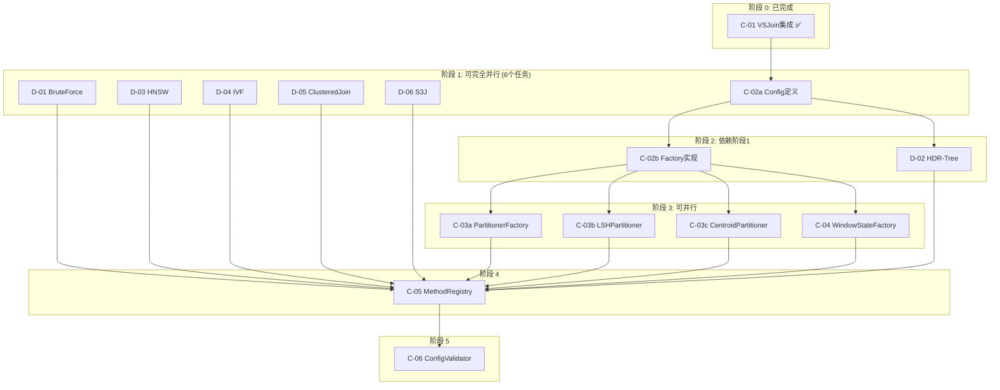

# SageFlow Join 算子流程详解

本文档详细介绍 SageFlow 中 Join 算子的完整执行流程，帮助新加入项目的开发者快速理解系统架构和数据流动方式。

---

## 目录

1. [概述](#1-概述)
2. [Pipeline 构建阶段](#2-pipeline-构建阶段)
3. [Planner 算子链构建](#3-planner-算子链构建)
4. [ExecutionGraph 连接构建](#4-executiongraph-连接构建)
5. [运行时数据流](#5-运行时数据流)
6. [JoinOperator 初始化](#6-joinoperator-初始化)
7. [JoinOperator 数据处理](#7-joinoperator-数据处理)
8. [组件交互总结](#8-组件交互总结)
9. [窗口状态与索引策略](#9-窗口状态与索引策略)

---

## 1. 概述

SageFlow 的 Join 算子用于实现两个向量数据流之间的相似性连接（Similarity Join）。系统支持多种 Join 策略，包括：

- **BruteForce**：暴力扫描，作为 Ground Truth
- **IVF**：基于倒排索引的近似方法
- **HNSW**：基于层次图的近似方法
- **VSJoin**：基于向量空间分区的高性能方法

整体流程分为两个阶段：
1. **构建阶段**：用户代码 → Stream DAG → Operator Chain → ExecutionGraph
2. **执行阶段**：数据流入 → 窗口管理 → 索引查询 → 相似度验证 → 结果输出

---

## 2. Pipeline 构建阶段

### 2.1 用户代码示例

```cpp
// 创建数据源
auto left_source = std::make_shared<TestVectorStreamSource>("left", left_data);
auto right_source = std::make_shared<TestVectorStreamSource>("right", right_data);

// 定义 Join 函数
auto join_func = std::make_unique<JoinFunction>("MyJoin", 
    [](std::unique_ptr<VectorRecord>& left, 
       std::unique_ptr<VectorRecord>& right) -> std::unique_ptr<VectorRecord> {
        // 合并左右向量
        return mergeVectors(left, right);
    }, 128);

// 构建 Pipeline
left_source->join(right_source, std::move(join_func), "bruteforce_lazy", 0.8, 4)
           ->writeSink(std::move(sink_func), 1);

// 执行
env.addStream(left_source);
env.addStream(right_source);
env.execute();
```

### 2.2 Stream::join() 方法处理

当调用 `join()` 方法时，系统执行以下操作：

```
┌─────────────────────────────────────────────────────────────────────────────┐
│                          Stream::join() 方法                                 │
├─────────────────────────────────────────────────────────────────────────────┤
│                                                                             │
│  输入参数:                                                                   │
│    - other_stream: 右侧数据流                                               │
│    - join_func: Join 函数（定义如何合并左右记录）                            │
│    - join_method: 算法名称（如 "bruteforce_lazy", "ivf_eager"）             │
│    - similarity_threshold: 相似度阈值                                       │
│    - parallelism: 并行度                                                    │
│                                                                             │
│  处理流程:                                                                   │
│    1. 创建新的 Stream 节点                                                  │
│    2. 将 right_source 绑定到 JoinFunction::other_stream_                    │
│    3. 设置 Join 配置参数（method, threshold）                               │
│    4. 设置并行度                                                            │
│                                                                             │
│  输出结果:                                                                   │
│    Stream DAG 结构:                                                         │
│      left_source ───┐                                                       │
│                     ├───> join_stream ───> sink_stream                      │
│      right_source ──┘                                                       │
│                                                                             │
└─────────────────────────────────────────────────────────────────────────────┘
```

### 2.3 StreamEnvironment::execute() 处理

```
┌─────────────────────────────────────────────────────────────────────────────┐
│                       StreamEnvironment::execute()                          │
├─────────────────────────────────────────────────────────────────────────────┤
│                                                                             │
│  Step 1: 创建 Planner                                                       │
│    - 传入 ConcurrencyManager（全局索引管理器）                               │
│                                                                             │
│  Step 2: 分配 Slot ID                                                       │
│    - 为每个 Source 分配唯一的 slotId                                        │
│    - left_source: slot = 0                                                  │
│    - right_source: slot = 1                                                 │
│                                                                             │
│  Step 3: 调用 Planner 构建执行图                                            │
│    planner.planToExecutionGraph(stream, execution_graph, parallelism)       │
│                                                                             │
│  Step 4: 构建连接并启动                                                      │
│    execution_graph.buildGraph()                                             │
│    execution_graph.start()                                                  │
│                                                                             │
└─────────────────────────────────────────────────────────────────────────────┘
```

---

## 3. Planner 算子链构建

Planner 负责将 Stream DAG 转换为 Operator Chain。

```
┌─────────────────────────────────────────────────────────────────────────────┐
│                    Planner::buildOperatorChain()                            │
├─────────────────────────────────────────────────────────────────────────────┤
│                                                                             │
│  遍历 Stream DAG，为每个节点创建对应的 Operator：                             │
│                                                                             │
│  ┌─────────────────────────────────────────────────────────────────────┐    │
│  │  Stream 类型        →        Operator 类型                          │    │
│  ├─────────────────────────────────────────────────────────────────────┤    │
│  │  DataStreamSource   →  OutputOperator（数据源输出）                  │    │
│  │  Filter Stream      →  FilterOperator                               │    │
│  │  Map Stream         →  MapOperator                                  │    │
│  │  Join Stream        →  JoinOperator                                 │    │
│  │  Sink Stream        →  SinkOperator                                 │    │
│  └─────────────────────────────────────────────────────────────────────┘    │
│                                                                             │
│  对于 Join 节点的特殊处理：                                                  │
│                                                                             │
│    1. 递归构建右侧输入流（right_op）                                         │
│                                                                             │
│    2. 创建 JoinOperator：                                                   │
│       JoinOperator(                                                         │
│         join_func,              // Join 函数                               │
│         concurrency_manager,     // 索引管理器                              │
│         join_method,             // 算法名称                                │
│         similarity_threshold     // 相似度阈值                              │
│       )                                                                     │
│                                                                             │
│    3. 设置 Slot ID：                                                        │
│       join_op->setSlots(left_slot=0, right_slot=1)                         │
│                                                                             │
│    4. 连接右侧输入：                                                         │
│       execution_graph->connectOperators(right_op, join_op, slot=1)         │
│                                                                             │
└─────────────────────────────────────────────────────────────────────────────┘
```

### JoinOperator 构造函数中的关键初始化

```
┌─────────────────────────────────────────────────────────────────────────────┐
│                    JoinOperator 构造函数                                     │
├─────────────────────────────────────────────────────────────────────────────┤
│                                                                             │
│  1. 解析 Join 方法名称：                                                     │
│     "bruteforce_lazy" → algo="bruteforce", is_eager_=false                 │
│     "ivf_eager"       → algo="ivf", is_eager_=true                         │
│     "vsjoin_lazy"     → algo="vsjoin", is_eager_=false                     │
│                                                                             │
│  2. 根据算法类型创建索引：                                                   │
│     ┌──────────────┬────────────────────────────────────────────────────┐  │
│     │  算法类型    │  索引创建                                           │  │
│     ├──────────────┼────────────────────────────────────────────────────┤  │
│     │  bruteforce  │  createIndexPair(BruteForce, "join_bf")            │  │
│     │  ivf         │  createIndexPair(IVF, "join_ivf", ivf_params)      │  │
│     │  vsjoin      │  vsjoin_config_.enabled = true（延迟到 open）       │  │
│     └──────────────┴────────────────────────────────────────────────────┘  │
│                                                                             │
│  3. 创建 JoinMethod：                                                       │
│     - BruteForceJoinMethod 或 IvfJoinMethod                                │
│     - 封装索引查询和候选获取逻辑                                             │
│                                                                             │
└─────────────────────────────────────────────────────────────────────────────┘
```

---

## 4. ExecutionGraph 连接构建

ExecutionGraph 负责创建并行执行顶点和队列连接。

### 4.1 创建执行顶点

```
┌─────────────────────────────────────────────────────────────────────────────┐
│                      ExecutionGraph::buildGraph()                           │
├─────────────────────────────────────────────────────────────────────────────┤
│                                                                             │
│  Step 1: 为每个 Operator 创建 ExecutionVertex                               │
│                                                                             │
│    ┌─────────────────────────────────────────────────────────────────────┐  │
│    │  Operator              │  并行度  │  创建的 Vertex                  │  │
│    ├─────────────────────────────────────────────────────────────────────┤  │
│    │  OutputOperator(left)  │    1     │  [Vertex[0]]                    │  │
│    │  OutputOperator(right) │    1     │  [Vertex[0]]                    │  │
│    │  JoinOperator          │    4     │  [Vertex[0], [1], [2], [3]]     │  │
│    │  SinkOperator          │    1     │  [Vertex[0]]                    │  │
│    └─────────────────────────────────────────────────────────────────────┘  │
│                                                                             │
│  每个 ExecutionVertex 包含：                                                 │
│    - operator_: 指向共享的 Operator 实例                                    │
│    - subtask_index_: 当前实例的索引（0-based）                              │
│    - input_gate_: 输入队列管理器                                            │
│    - result_partition_: 输出分区管理器                                      │
│                                                                             │
└─────────────────────────────────────────────────────────────────────────────┘
```

### 4.2 创建队列连接

```
┌─────────────────────────────────────────────────────────────────────────────┐
│                     队列连接策略                                             │
├─────────────────────────────────────────────────────────────────────────────┤
│                                                                             │
│  使用 PartitionedConnectionStrategy（默认策略）：                            │
│                                                                             │
│  连接 left_source → join (slot=0):                                          │
│    - 创建 1 个队列（= upstream_parallelism）                                │
│    - ResultPartition: left[0] 使用 RoundRobinPartitioner 发送到 queue[0]   │
│    - InputGate: 所有 join[0,1,2,3] 都订阅 queue[0]                          │
│                                                                             │
│  连接 right_source → join (slot=1):                                         │
│    - 创建 1 个队列                                                          │
│    - ResultPartition: right[0] 发送到 queue[0]                              │
│    - InputGate: 所有 join[0,1,2,3] 追加订阅 queue[0]                        │
│                                                                             │
│  连接 join → sink (slot=0):                                                 │
│    - 创建 4 个队列（= upstream_parallelism）                                │
│    - 每个 join[i] 的 ResultPartition 连接到 queue[i]                        │
│    - sink[0] 的 InputGate 订阅所有 4 个队列                                 │
│                                                                             │
└─────────────────────────────────────────────────────────────────────────────┘
```

### 4.3 最终拓扑结构

```
┌─────────────────────────────────────────────────────────────────────────────┐
│                          执行拓扑图                                          │
├─────────────────────────────────────────────────────────────────────────────┤
│                                                                             │
│   ┌────────────┐          queue_L          ┌────────────────┐              │
│   │ left[0]    │─────────────────────────▶│                │              │
│   └────────────┘     (slot=0)              │                │              │
│                                            │  JoinOp[0]     │───┐          │
│   ┌────────────┐          queue_R          │  JoinOp[1]     │───┤          │
│   │ right[0]   │─────────────────────────▶│  JoinOp[2]     │───┼──▶Sink[0]│
│   └────────────┘     (slot=1)              │  JoinOp[3]     │───┘          │
│                                            │                │              │
│                                            └────────────────┘              │
│                                                                             │
│   数据流向说明：                                                             │
│     1. left[0] 产生的数据带 slot=0 标记，写入 queue_L                        │
│     2. right[0] 产生的数据带 slot=1 标记，写入 queue_R                       │
│     3. JoinOp[0-3] 竞争消费两个队列中的数据                                  │
│     4. 每条数据通过 slot 标记区分来自左流还是右流                            │
│                                                                             │
└─────────────────────────────────────────────────────────────────────────────┘
```

---

## 5. 运行时数据流

### 5.1 ExecutionVertex 执行循环

```
┌─────────────────────────────────────────────────────────────────────────────┐
│                     ExecutionVertex::run() 循环                              │
├─────────────────────────────────────────────────────────────────────────────┤
│                                                                             │
│  // 创建运行时上下文                                                         │
│  RuntimeContext context(subtask_index_, parallelism_);                      │
│                                                                             │
│  // 初始化算子                                                               │
│  operator_->open(context);                                                  │
│                                                                             │
│  // 创建 Collector（用于发送输出）                                           │
│  Collector collector([this](std::unique_ptr<Response> r, int slot) {        │
│      result_partition_->emit(std::move(*r), slot);                          │
│  });                                                                        │
│                                                                             │
│  // 主循环                                                                   │
│  while (running_) {                                                         │
│      // 从输入门读取数据（返回 TaggedResponse，包含 slot 信息）              │
│      auto data_opt = input_gate_->read();                                   │
│      if (!data_opt) {                                                       │
│          sleep(100us);                                                      │
│          continue;                                                          │
│      }                                                                      │
│                                                                             │
│      // 调用算子处理，传入 slot 和运行时上下文                               │
│      operator_->apply(data_opt->response, data_opt->slot,                   │
│                       collector, context);                                  │
│  }                                                                          │
│                                                                             │
│  // 关闭算子                                                                 │
│  operator_->close();                                                        │
│                                                                             │
└─────────────────────────────────────────────────────────────────────────────┘
```

### 5.2 数据流动示意

```
┌─────────────────────────────────────────────────────────────────────────────┐
│                          数据流动过程                                        │
├─────────────────────────────────────────────────────────────────────────────┤
│                                                                             │
│  1. 数据源产生记录                                                          │
│     left_source.Next() → VectorRecord(uid=1, ts=1000, vec=[...])           │
│                                                                             │
│  2. OutputOperator 包装并发送                                               │
│     Response{type=Record, record=...}                                       │
│     result_partition.emit(response, slot=0)                                 │
│                                                                             │
│  3. 队列传输                                                                │
│     queue.push(TaggedResponse{response, slot=0})                            │
│                                                                             │
│  4. JoinOperator 接收并处理                                                 │
│     input_gate.read() → TaggedResponse{response, slot=0}                    │
│     join_op.apply(response, slot=0, collector, context)                     │
│                                                                             │
│  5. Join 处理并输出结果                                                      │
│     collector.collect(result_response, output_slot)                         │
│                                                                             │
└─────────────────────────────────────────────────────────────────────────────┘
```

---

## 6. JoinOperator 初始化

### 6.1 open() 方法

```
┌─────────────────────────────────────────────────────────────────────────────┐
│                    JoinOperator::open(context)                              │
├─────────────────────────────────────────────────────────────────────────────┤
│                                                                             │
│  输入：RuntimeContext(subtask_index, parallelism)                           │
│                                                                             │
│  处理流程：                                                                  │
│                                                                             │
│  if (vsjoin_config_.enabled) {                                              │
│      // VSJoin 模式：初始化专用组件                                          │
│      initVSJoinComponents(context);                                         │
│      return;                                                                │
│  }                                                                          │
│                                                                             │
│  // 标准模式：根据配置创建窗口状态                                           │
│  if (use_shared_state_) {                                                   │
│      // 共享状态模式：所有 subtask 共享同一份状态                            │
│      left_state_ = std::make_unique<SharedWindowState>();                   │
│      right_state_ = std::make_unique<SharedWindowState>();                  │
│  } else {                                                                   │
│      // 分区状态模式：每个 subtask 有独立的状态分片                          │
│      left_state_ = std::make_unique<PartitionedWindowState>(parallelism);   │
│      right_state_ = std::make_unique<PartitionedWindowState>(parallelism);  │
│  }                                                                          │
│                                                                             │
│  注意：索引是在构造函数中创建的，所有实例共享同一个索引                       │
│                                                                             │
└─────────────────────────────────────────────────────────────────────────────┘
```

### 6.2 VSJoin 组件初始化

```
┌─────────────────────────────────────────────────────────────────────────────┐
│                  initVSJoinComponents(context)                              │
├─────────────────────────────────────────────────────────────────────────────┤
│                                                                             │
│  1. 初始化向量空间分区器                                                     │
│     vsjoin_partitioner_ = std::make_shared<LSHPartitioner>(                 │
│         dimension, num_hash_functions=8, seed=42, boundary_threshold=0.1);  │
│                                                                             │
│  2. 初始化分区向量状态（双层窗口 + 向量空间分区）                            │
│     left_vsjoin_state_ = std::make_unique<PartitionedVectorState>(          │
│         num_partitions, partitioner, compact_threshold, boundary_tracking); │
│     right_vsjoin_state_ = ...                                               │
│                                                                             │
│  3. 初始化分区索引                                                          │
│     left_vsjoin_index_ = std::make_shared<PartitionedIndex>(                │
│         num_partitions, dimension, partitioner, ivf_nlist, ivf_nprobes);    │
│     concurrency_manager_->register_index("vsjoin_left_...", left_index);    │
│                                                                             │
│  4. 初始化分区协调器                                                        │
│     vsjoin_coordinator_ = std::make_unique<PartitionCoordinator>(           │
│         num_partitions, partitioner, allowed_lateness, watermark_delay);    │
│                                                                             │
│  5. 初始化异步候选生成器                                                     │
│     left_async_generator_ = std::make_unique<AsyncCandidateGenerator>(      │
│         left_index, num_threads);                                           │
│                                                                             │
│  6. 初始化距离验证器                                                        │
│     vsjoin_verifier_ = std::make_shared<DistanceVerifier>(                  │
│         threshold, distance_alpha);                                         │
│                                                                             │
└─────────────────────────────────────────────────────────────────────────────┘
```

---

## 7. JoinOperator 数据处理

### 7.1 apply() 方法主流程

```
┌─────────────────────────────────────────────────────────────────────────────┐
│               JoinOperator::apply(record, slot, collector, context)         │
├─────────────────────────────────────────────────────────────────────────────┤
│                                                                             │
│  Step 1: 确定记录属于哪一侧                                                  │
│    ┌──────────────────────────────────────────────────────────────────────┐ │
│    │  slot == left_slot_id_ (0)  → 左侧记录，目标：右侧窗口                │ │
│    │  slot == right_slot_id_ (1) → 右侧记录，目标：左侧窗口                │ │
│    └──────────────────────────────────────────────────────────────────────┘ │
│                                                                             │
│  Step 2: 更新窗口状态                                                        │
│    updateSideWithState(current_state, index_id, record, timestamp,          │
│                        slot, subtask_index)                                 │
│      │                                                                      │
│      ├─ state->addRecord(record, subtask_index)    // 添加到窗口            │
│      ├─ concurrency_manager_->insert(index_id, record)  // 插入共享索引     │
│      └─ state->evictExpired(...)                   // 清理过期记录          │
│                                                                             │
│  Step 3: 检查是否触发 Join                                                  │
│    bool trigger = window.isNeedTrigger(timestamp)                           │
│    if (!trigger) return;  // 未达到触发条件，直接返回                        │
│                                                                             │
│  Step 4: 执行 Join（根据 Eager/Lazy 模式）                                  │
│    if (is_eager_) {                                                         │
│        executeJoinWithState(record, opposite_state, ...);                   │
│    } else {                                                                 │
│        executeLazyJoin(...);                                                │
│    }                                                                        │
│                                                                             │
│  Step 5: 发送 Join 结果                                                     │
│    for (auto& result : results) {                                           │
│        collector.collect(std::move(result), output_slot);                   │
│    }                                                                        │
│                                                                             │
└─────────────────────────────────────────────────────────────────────────────┘
```

### 7.2 Eager vs Lazy 模式

```
┌─────────────────────────────────────────────────────────────────────────────┐
│                     Eager 模式 vs Lazy 模式                                  │
├─────────────────────────────────────────────────────────────────────────────┤
│                                                                             │
│  ┌─────────────────────────────────────────────────────────────────────────┐│
│  │                        Eager 模式                                       ││
│  ├─────────────────────────────────────────────────────────────────────────┤│
│  │  触发时机：每条记录到达时立即执行                                        ││
│  │  处理逻辑：                                                              ││
│  │    1. 用当前记录在对面窗口查询候选项                                     ││
│  │    2. 对每个候选项验证相似度                                             ││
│  │    3. 输出满足阈值的匹配对                                               ││
│  │  适用场景：低延迟要求，实时输出                                          ││
│  └─────────────────────────────────────────────────────────────────────────┘│
│                                                                             │
│  ┌─────────────────────────────────────────────────────────────────────────┐│
│  │                        Lazy 模式                                        ││
│  ├─────────────────────────────────────────────────────────────────────────┤│
│  │  触发时机：窗口滑动时批量执行                                            ││
│  │  处理逻辑：                                                              ││
│  │    1. 获取当前窗口的所有记录                                             ││
│  │    2. 对每条记录查询对面窗口的候选项                                     ││
│  │    3. 批量执行 Join 并输出                                               ││
│  │    4. 清空当前窗口                                                       ││
│  │  适用场景：高吞吐要求，批量处理                                          ││
│  └─────────────────────────────────────────────────────────────────────────┘│
│                                                                             │
└─────────────────────────────────────────────────────────────────────────────┘
```

### 7.3 窗口更新详细流程

```
┌─────────────────────────────────────────────────────────────────────────────┐
│                    updateSideWithState() 详细流程                            │
├─────────────────────────────────────────────────────────────────────────────┤
│                                                                             │
│  输入：                                                                      │
│    - state: 目标窗口状态（left_state_ 或 right_state_）                     │
│    - index_id: 对应的索引 ID                                                │
│    - record: 待添加的记录                                                   │
│    - timestamp: 记录时间戳                                                  │
│    - slot: 来源标识（0=左, 1=右）                                           │
│    - subtask_index: 当前子任务索引                                          │
│                                                                             │
│  处理步骤：                                                                  │
│                                                                             │
│  1. 创建索引记录副本                                                        │
│     data_for_index = std::make_unique<VectorRecord>(*record)                │
│                                                                             │
│  2. 添加记录到窗口状态                                                      │
│     state->addRecord(std::move(record), subtask_index)                      │
│     ┌───────────────────────────────────────────────────────────────────┐   │
│     │  PartitionedWindowState:                                          │   │
│     │    partitions_[subtask_index].push_back(record)                   │   │
│     │                                                                   │   │
│     │  SharedWindowState:                                               │   │
│     │    records_.push_back(record)  // 全局共享                        │   │
│     └───────────────────────────────────────────────────────────────────┘   │
│                                                                             │
│  3. 插入到共享索引                                                          │
│     concurrency_manager_->insert(index_id, std::move(data_for_index))       │
│                                                                             │
│  4. 清理过期记录                                                            │
│     int64_t timelimit = timestamp - window_size                             │
│     state->evictExpired(timestamp, window_size, subtask_index)              │
│     // 同时从索引中删除过期记录                                             │
│                                                                             │
│  5. 检查触发条件                                                            │
│     return window.isNeedTrigger(timestamp)                                  │
│                                                                             │
└─────────────────────────────────────────────────────────────────────────────┘
```

---

## 8. 组件交互总结

```
┌─────────────────────────────────────────────────────────────────────────────┐
│                         Join 组件交互图                                      │
├─────────────────────────────────────────────────────────────────────────────┤
│                                                                             │
│  ┌─────────────────┐                                                        │
│  │  JoinFunction   │ ← 窗口配置 (windowSize, stepSize)                      │
│  │  - threadSafeWindowL/R (触发条件判断)                                    │
│  │  - Execute(left, right) (合并左右记录)                                   │
│  └────────┬────────┘                                                        │
│           │                                                                 │
│           ▼                                                                 │
│  ┌─────────────────────────────────────────────────────────────────────────┐│
│  │                          JoinOperator                                   ││
│  │                                                                         ││
│  │  ┌─────────────────┐    ┌─────────────────┐    ┌──────────────────┐    ││
│  │  │  WindowState    │    │  JoinMethod     │    │ ConcurrencyManager│    ││
│  │  │  (left/right)   │    │  (执行策略)      │    │ (索引管理)        │    ││
│  │  │                 │    │                 │    │                  │    ││
│  │  │ - addRecord()   │    │ - ExecuteEager()│    │ - insert()       │    ││
│  │  │ - getRecords()  │    │ - ExecuteLazy() │    │ - query()        │    ││
│  │  │ - evictExpired()│    │                 │    │ - erase()        │    ││
│  │  └────────┬────────┘    └────────┬────────┘    └────────┬─────────┘    ││
│  │           │                      │                      │              ││
│  │           └──────────────────────┴──────────────────────┘              ││
│  │                                  │                                      ││
│  │                                  ▼                                      ││
│  │  ┌───────────────────────────────────────────────────────────────────┐ ││
│  │  │                         apply() 流程                               │ ││
│  │  │                                                                   │ ││
│  │  │  1. 解析 slot 确定左/右侧                                          │ ││
│  │  │  2. updateSideWithState() → 更新窗口 + 索引                        │ ││
│  │  │  3. isNeedTrigger() → 检查触发条件                                 │ ││
│  │  │  4. getCandidatesFromState() → 获取候选项                          │ ││
│  │  │  5. executeJoinWithState() / executeLazyJoin() → 验证 + 执行       │ ││
│  │  │  6. collector.collect() → 发送结果                                 │ ││
│  │  └───────────────────────────────────────────────────────────────────┘ ││
│  └─────────────────────────────────────────────────────────────────────────┘│
│                                                                             │
└─────────────────────────────────────────────────────────────────────────────┘
```

---

## 9. 窗口状态与索引策略

### 9.1 状态策略选择

系统提供两种窗口状态策略：

| 策略类型 | 类名 | 特点 | 适用场景 |
|---------|------|------|---------|
| 分区状态 | `PartitionedWindowState` | 每个 subtask 有独立状态，无需同步 | 高吞吐、基于内容分区的场景 |
| 共享状态 | `SharedWindowState` | 所有 subtask 共享状态，需要同步 | 保证完整性、随机分区的场景 |

### 9.2 索引策略

```
┌─────────────────────────────────────────────────────────────────────────────┐
│                          索引策略对比                                        │
├─────────────────────────────────────────────────────────────────────────────┤
│                                                                             │
│  ┌─────────────────────────────────────────────────────────────────────────┐│
│  │  共享索引模式（标准 Join 方法使用）                                      ││
│  ├─────────────────────────────────────────────────────────────────────────┤│
│  │  - 所有 JoinOperator 实例共享同一对索引                                  ││
│  │  - 通过 ConcurrencyManager 保证线程安全                                  ││
│  │  - 索引包含所有实例插入的记录                                            ││
│  │  - 查询可以跨实例获取候选项                                              ││
│  └─────────────────────────────────────────────────────────────────────────┘│
│                                                                             │
│  ┌─────────────────────────────────────────────────────────────────────────┐│
│  │  分区索引模式（VSJoin 使用）                                             ││
│  ├─────────────────────────────────────────────────────────────────────────┤│
│  │  - 使用 PartitionedIndex 按向量空间分区                                  ││
│  │  - 每个分区独立的 IVF 索引                                               ││
│  │  - 查询时根据向量位置路由到相关分区                                      ││
│  │  - 边界向量可能需要查询多个分区                                          ││
│  └─────────────────────────────────────────────────────────────────────────┘│
│                                                                             │
└─────────────────────────────────────────────────────────────────────────────┘
```

### 9.3 策略选择指南

```
┌─────────────────────────────────────────────────────────────────────────────┐
│                        策略组合选择指南                                      │
├─────────────────────────────────────────────────────────────────────────────┤
│                                                                             │
│  ┌──────────────────────┬─────────────────┬─────────────────────────────┐  │
│  │  分区策略            │  窗口状态        │  适用场景                    │  │
│  ├──────────────────────┼─────────────────┼─────────────────────────────┤  │
│  │  RoundRobin          │  SharedWindow   │  简单负载均衡，保证正确性    │  │
│  │  KeyPartitioner      │  Partitioned    │  基于内容分区，高性能        │  │
│  │  VectorHash          │  Partitioned    │  相似向量聚集，高召回        │  │
│  │  VSJoin Partitioner  │  PartitionedVec │  向量空间分区，最佳平衡      │  │
│  └──────────────────────┴─────────────────┴─────────────────────────────┘  │
│                                                                             │
│  注意：                                                                      │
│    - RoundRobin + PartitionedWindowState 会导致召回率下降                   │
│    - 需要根据具体的 Baseline 方法选择合适的组合                             │
│                                                                             │
└─────────────────────────────────────────────────────────────────────────────┘
```

---

## 附录：关键类说明

| 类名 | 文件位置 | 职责 |
|------|---------|------|
| `Stream` | `include/stream/stream.h` | 声明式 API，构建 DAG |
| `Planner` | `include/query/optimizer/planner.h` | Stream DAG → Operator Chain |
| `ExecutionGraph` | `include/execution/execution_graph.h` | 管理并行执行拓扑 |
| `ExecutionVertex` | `include/execution/execution_vertex.h` | Operator 的并行实例 |
| `JoinOperator` | `include/operator/join_operator.h` | Join 算子核心逻辑 |
| `JoinFunction` | `include/function/join_function.h` | 用户定义的 Join 逻辑 |
| `WindowState` | `include/state/window_state.h` | 窗口状态抽象接口 |
| `ConcurrencyManager` | `include/concurrency/concurrency_manager.h` | 线程安全索引管理 |
| `BaseMethod` | `include/operator/join_operator_methods/base_method.h` | Join 算法接口 |

---

## 附录 B：开发任务依赖关系图

本节描述 C 组（配置驱动集成）和 D 组（Baseline 实现）任务之间的依赖关系，用于指导并行开发工作。

### 任务概览

| 任务ID | 名称 | 描述 | 预估工时 |
|--------|------|------|----------|
| C-01 | VSJoin 集成 | ✅ 已完成 | - |
| C-02 | 策略工厂 | JoinStrategyConfig + Factory | 2 天 |
| C-03 | 分区策略选择 | PartitionerFactory + LSH/Centroid | 2 天 |
| C-04 | 窗口状态选择 | WindowStateFactory | 0.5 天 |
| C-05 | 方法注册系统 | JoinMethodRegistry | 2 天 |
| C-06 | 配置验证 | JoinConfigValidator | 1 天 |
| D-01 | BruteForce Baseline | Ground Truth | 1 天 |
| D-02 | HDR-Tree Baseline | PCA + R-Tree | 3-4 天 |
| D-03 | HNSW Baseline | HNSW 封装 | 1-2 天 |
| D-04 | IVF Baseline | IVF 封装 | 1-2 天 |
| D-05 | ClusteredJoin | VectraFlow 方法 | 2-3 天 |
| D-06 | S3J Baseline | DEBS'23 方法 | 3-4 天 |

### 依赖关系图



### 执行计划

| 阶段 | 可并行任务数 | 时间 | 任务列表 |
|------|-------------|------|----------|
| 阶段 1 | 6 | Day 1-2 | D-01, D-03, D-04, D-05, D-06, C-02a |
| 阶段 2 | 2 | Day 3-4 | C-02b, D-02 |
| 阶段 3 | 4 | Day 5 | C-03a, C-03b, C-03c, C-04 |
| 阶段 4 | 1 | Day 6-7 | C-05 |
| 阶段 5 | 1 | Day 8 | C-06 |

**详细的任务拆分和提示词请参考**: `docs/tasks/PARALLEL_TASK_GUIDE.md`

