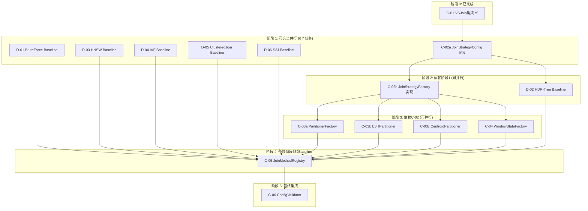

# 并行任务执行指南

本文档将 C 组和 D 组任务拆分为可并行执行的子任务，以便分派给多个 Copilot 同时工作。

---

## 一、任务依赖关系总览

### 1.1 依赖关系图



### 1.2 阶段划分与并行度

| 阶段 | 可并行任务数 | 预计总工时 | 描述 |
|------|-------------|-----------|------|
| 阶段 1 | 6 | 1-2 天 | 基础 Baseline 和配置定义 |
| 阶段 2 | 2 | 2-3 天 | 策略工厂和 HDR-Tree |
| 阶段 3 | 4 | 1-2 天 | 分区策略和窗口状态工厂 |
| 阶段 4 | 1 | 2 天 | 方法注册系统 |
| 阶段 5 | 1 | 1 天 | 配置验证 |

---

## 二、阶段 1：可完全并行的任务

### 任务 1-A: D-01 BruteForce Baseline

**负责人**: Copilot #1  
**预估工时**: 1 天  
**无依赖**

#### 详细提示词

```markdown
你是 sageFlow 项目的开发者，需要实现 BruteForce Baseline 作为 Ground Truth。

## 项目背景
sageFlow 是一个向量流处理引擎，支持实时向量相似度 Join 操作。
BruteForce Baseline 是最基础的实现，用于验证其他近似算法的召回率。

## 阅读材料
1. 首先阅读 `.github/copilot-instructions.md` 了解项目结构和编码规范
2. 阅读 `include/operator/join_operator_methods/base_method.h` 了解 BaseMethod 接口
3. 阅读 `docs/JOIN_PIPELINE_GUIDE.md` 了解 Join 流程

## 任务要求

### 1. 创建头文件: `include/operator/join_operator_methods/bruteforce_join_method.h`

```cpp
#pragma once

#include "operator/join_operator_methods/base_method.h"
#include <deque>
#include <memory>
#include <mutex>

namespace sageFlow {

class BruteForceJoinMethod : public BaseMethod {
public:
    BruteForceJoinMethod(double threshold, int64_t window_size);
    
    std::vector<std::unique_ptr<VectorRecord>> ExecuteEager(
        const VectorRecord& query, int slot) override;
    
    std::vector<std::unique_ptr<VectorRecord>> ExecuteLazy(
        const std::deque<std::unique_ptr<VectorRecord>>& queries, int slot) override;
    
    void updateState(std::unique_ptr<VectorRecord> record, int slot) override;
    void evictExpired(int64_t current_timestamp) override;
    
    size_t getLeftWindowSize() const;
    size_t getRightWindowSize() const;

private:
    double threshold_;
    int64_t window_size_;
    
    std::deque<std::unique_ptr<VectorRecord>> left_window_;
    std::deque<std::unique_ptr<VectorRecord>> right_window_;
    mutable std::shared_mutex window_mutex_;
    
    std::vector<std::unique_ptr<VectorRecord>> bruteForceMatch(
        const VectorRecord& query,
        const std::deque<std::unique_ptr<VectorRecord>>& window);
};

} // namespace sageFlow
```

### 2. 创建实现文件: `src/operator/join_operator_methods/bruteforce_join_method.cpp`

实现要点:
- ExecuteEager: slot=0 时在 right_window 搜索，slot=1 时在 left_window 搜索
- bruteForceMatch: 使用 CosineSimilarity 计算相似度，返回超过阈值的记录
- evictExpired: 移除时间戳过期的记录
- 需要线程安全（使用 shared_mutex）

### 3. 创建单元测试: `test/UnitTest/test_bruteforce_join_method.cpp`

测试用例:
- BasicMatch: 验证基本匹配功能
- WindowEviction: 验证窗口过期清理
- ThreadSafety: 验证并发访问安全
- PerfectRecall: 验证 100% 召回率

### 4. 更新 CMakeLists.txt
在 `src/CMakeLists.txt` 和 `test/CMakeLists.txt` 中添加新文件

## 验收标准
1. `ctest -R test_bruteforce_join_method` 全部通过
2. clang-tidy 检查通过
3. 代码符合项目命名规范
```

---

### 任务 1-B: D-03 HNSW Join Method

**负责人**: Copilot #2  
**预估工时**: 1-2 天  
**无依赖**

#### 详细提示词

```markdown
你是 sageFlow 项目的开发者，需要封装现有 HNSW 索引为 Join 方法。

## 项目背景
HNSW 是高效的近似最近邻索引，作为 VSJoin 的重要 Baseline。

## 阅读材料
1. `.github/copilot-instructions.md` - 项目规范
2. `include/index/hnsw.h` - 现有 HNSW 实现
3. `include/concurrency/concurrency_manager.h` - 索引管理器
4. `include/operator/join_operator_methods/base_method.h` - BaseMethod 接口

## 任务要求

### 1. 创建头文件: `include/operator/join_operator_methods/hnsw_join_method.h`

```cpp
#pragma once

#include "operator/join_operator_methods/base_method.h"
#include "concurrency/concurrency_manager.h"
#include <memory>
#include <unordered_map>
#include <shared_mutex>

namespace sageFlow {

class HNSWJoinMethod : public BaseMethod {
public:
    HNSWJoinMethod(double threshold, int dimension,
                   int m = 16, int ef_construction = 200, int ef_search = 50);
    
    std::vector<std::unique_ptr<VectorRecord>> ExecuteEager(
        const VectorRecord& query, int slot) override;
    
    std::vector<std::unique_ptr<VectorRecord>> ExecuteLazy(
        const std::deque<std::unique_ptr<VectorRecord>>& queries, int slot) override;
    
    void updateState(std::unique_ptr<VectorRecord> record, int slot) override;
    void evictExpired(int64_t current_timestamp) override;
    
    void setEfSearch(int ef_search);
    size_t getLeftIndexSize() const;
    size_t getRightIndexSize() const;

private:
    double threshold_;
    int dimension_;
    
    std::shared_ptr<ConcurrencyManager> concurrency_manager_;
    int left_index_id_;
    int right_index_id_;
    
    std::unordered_map<uint64_t, int64_t> left_timestamps_;
    std::unordered_map<uint64_t, int64_t> right_timestamps_;
    mutable std::shared_mutex timestamp_mutex_;
};

} // namespace sageFlow
```

### 2. 实现要点

- 构造函数: 通过 ConcurrencyManager::create_index() 创建左右 HNSW 索引
- ExecuteEager: 使用 concurrency_manager_->query_for_join() 查询
- updateState: 调用 concurrency_manager_->insert() 并记录时间戳
- evictExpired: 遍历时间戳 map，调用 erase() 删除过期记录

### 3. 测试要求

- BasicFunctionality: 测试基本 Join 功能
- RecallRate: 使用 BruteForce 结果验证召回率 > 95%
- DeletionPerformance: 测试大量删除后的性能

## 验收标准
1. 单元测试通过
2. 召回率 > 95%（与 BruteForce 对比）
3. 性能数据记录到测试输出
```

---

### 任务 1-C: D-04 IVF Join Method

**负责人**: Copilot #3  
**预估工时**: 1-2 天  
**无依赖**

#### 详细提示词

```markdown
你是 sageFlow 项目的开发者，需要封装现有 IVF 索引为 Join 方法。

## 阅读材料
1. `.github/copilot-instructions.md` - 项目规范
2. `include/index/ivf.h` - 现有 IVF 实现
3. `include/concurrency/concurrency_manager.h` - 索引管理器
4. `include/operator/join_operator_methods/base_method.h` - BaseMethod 接口

## 任务要求

### 1. 创建头文件: `include/operator/join_operator_methods/ivf_join_method.h`

```cpp
#pragma once

#include "operator/join_operator_methods/base_method.h"
#include "concurrency/concurrency_manager.h"
#include <memory>

namespace sageFlow {

class IVFJoinMethod : public BaseMethod {
public:
    IVFJoinMethod(double threshold, int dimension,
                  int nlist = 100, int nprobes = 10,
                  double rebuild_threshold = 0.3);
    
    std::vector<std::unique_ptr<VectorRecord>> ExecuteEager(
        const VectorRecord& query, int slot) override;
    
    std::vector<std::unique_ptr<VectorRecord>> ExecuteLazy(
        const std::deque<std::unique_ptr<VectorRecord>>& queries, int slot) override;
    
    void updateState(std::unique_ptr<VectorRecord> record, int slot) override;
    void evictExpired(int64_t current_timestamp) override;
    
    void setNprobes(int nprobes);
    void retrain();

private:
    double threshold_;
    int dimension_;
    int nlist_;
    int nprobes_;
    
    std::shared_ptr<ConcurrencyManager> concurrency_manager_;
    int left_index_id_;
    int right_index_id_;
    
    std::unordered_map<uint64_t, int64_t> left_timestamps_;
    std::unordered_map<uint64_t, int64_t> right_timestamps_;
    mutable std::shared_mutex timestamp_mutex_;
};

} // namespace sageFlow
```

### 2. 实现要点

与 HNSW 类似，但使用 IVF 索引。注意:
- IVF 需要初始化聚类中心，需要考虑初始数据量不足的情况
- 实现 retrain() 用于重新训练聚类中心

## 验收标准
1. 单元测试通过
2. 召回率 > 90%
```

---

### 任务 1-D: D-05 ClusteredJoin Baseline

**负责人**: Copilot #4  
**预估工时**: 2-3 天  
**无依赖**

#### 详细提示词

```markdown
你是 sageFlow 项目的开发者，需要实现 VectraFlow 的 ClusteredJoin 算法。

## 背景
ClusteredJoin 使用在线 k-means 对向量进行聚类，只在相似聚类之间进行连接。

## 阅读材料
1. `.github/copilot-instructions.md` - 项目规范
2. `include/operator/join_operator_methods/base_method.h` - BaseMethod 接口
3. `include/compute_engine/distance.h` - 距离计算函数

## 任务要求

### 1. 创建头文件: `include/operator/join_operator_methods/clustered_join_method.h`

```cpp
#pragma once

#include "operator/join_operator_methods/base_method.h"
#include <vector>
#include <memory>
#include <shared_mutex>

namespace sageFlow {

struct Cluster {
    size_t id;
    std::vector<float> centroid;
    size_t count;
    std::vector<float> sum;  // 用于增量更新中心
    std::deque<std::unique_ptr<VectorRecord>> members;
};

class ClusteredJoinMethod : public BaseMethod {
public:
    ClusteredJoinMethod(double threshold, int dimension,
                        int num_clusters = 16,
                        double centroid_threshold = 0.7);
    
    std::vector<std::unique_ptr<VectorRecord>> ExecuteEager(
        const VectorRecord& query, int slot) override;
    
    std::vector<std::unique_ptr<VectorRecord>> ExecuteLazy(
        const std::deque<std::unique_ptr<VectorRecord>>& queries, int slot) override;
    
    void updateState(std::unique_ptr<VectorRecord> record, int slot) override;
    void evictExpired(int64_t current_timestamp) override;
    
    struct ClusterStats {
        int num_clusters;
        size_t min_size;
        size_t max_size;
        double avg_size;
    };
    ClusterStats getLeftClusterStats() const;
    ClusterStats getRightClusterStats() const;

private:
    double threshold_;
    int dimension_;
    int num_clusters_;
    double centroid_threshold_;
    
    std::vector<Cluster> left_clusters_;
    std::vector<Cluster> right_clusters_;
    mutable std::shared_mutex cluster_mutex_;
    
    size_t next_cluster_id_{0};
    
    size_t findNearestCluster(const std::vector<float>& vec,
                               const std::vector<Cluster>& clusters);
    
    void updateCentroid(Cluster& cluster, const std::vector<float>& vec);
    
    std::vector<std::pair<size_t, size_t>> findSimilarClusterPairs(
        const std::vector<Cluster>& clusters1,
        const std::vector<Cluster>& clusters2);
    
    std::vector<std::unique_ptr<VectorRecord>> searchInCluster(
        const VectorRecord& query,
        const Cluster& cluster);
};

} // namespace sageFlow
```

### 2. 实现要点

1. **updateState()**: 
   - 找到最近的聚类
   - 如果距离超过阈值，创建新聚类
   - 使用增量更新公式更新中心: new_centroid = old_centroid + (vec - old_centroid) / count

2. **ExecuteEager()**:
   - 找到查询所属聚类
   - 找到对侧相似聚类（中心相似度 > centroid_threshold）
   - 在相似聚类中暴力搜索

3. **evictExpired()**:
   - 从成员列表移除过期记录
   - 更新聚类中心
   - 空聚类可删除或保留

### 3. 测试要求

- ClusterFormation: 测试聚类正确形成
- OnlineUpdate: 测试增量更新
- CrossClusterJoin: 测试跨聚类连接
- RecallRate: 召回率 > 90%

## 验收标准
1. 单元测试通过
2. 聚类负载相对均衡
3. 召回率 > 90%
```

---

### 任务 1-E: D-06 S3J Baseline

**负责人**: Copilot #5  
**预估工时**: 3-4 天  
**无依赖**

#### 详细提示词

```markdown
你是 sageFlow 项目的开发者，需要实现完整的 S3J (DEBS'23) Baseline。

## 背景
S3J 是基于质心分区和区域分组的流式向量 Join 方法:
1. 基于质心的物理分区
2. 自适应区域分组: Inner/Outer/Outlier
3. 分布式状态管理

## 阅读材料
1. `.github/copilot-instructions.md` - 项目规范
2. `docs/JOIN_PIPELINE_GUIDE.md` - Join 流程
3. `include/operator/join_operator_methods/base_method.h` - BaseMethod 接口

## 任务要求

### 1. S3JPartitioner: `include/execution/s3j_partitioner.h`

```cpp
#pragma once
#include "common/vector_record.h"
#include <vector>

namespace sageFlow {

class S3JPartitioner {
public:
    void initRandomCentroids(const std::vector<std::vector<float>>& samples, 
                             int num_centroids);
    
    struct PartitionResult {
        int partition_id;
        double distance_to_centroid;
    };
    PartitionResult assignPartition(const VectorRecord& record);
    
    void updateCentroids(const std::vector<std::vector<float>>& new_centroids);
    
    const std::vector<std::vector<float>>& getCentroids() const;

private:
    std::vector<std::vector<float>> centroids_;
};

} // namespace sageFlow
```

### 2. S3JZoneClassifier: `include/execution/s3j_zone_classifier.h`

```cpp
#pragma once

namespace sageFlow {

enum class S3JZone { INNER, OUTER, OUTLIER };

class S3JZoneClassifier {
public:
    explicit S3JZoneClassifier(double threshold);
    
    S3JZone classify(double distance_to_centroid) const;
    
    double getInnerBoundary() const { return 0.5 * threshold_; }
    double getOuterBoundary() const { return 2.0 * threshold_; }

private:
    double threshold_;
};

} // namespace sageFlow
```

### 3. S3JJoinState: `include/state/s3j_join_state.h`

```cpp
#pragma once
#include "common/vector_record.h"
#include "execution/s3j_zone_classifier.h"
#include <unordered_map>
#include <vector>
#include <memory>

namespace sageFlow {

class S3JJoinState {
public:
    void addRecord(int partition_id, S3JZone zone, 
                   std::unique_ptr<VectorRecord> record);
    
    const std::vector<std::shared_ptr<VectorRecord>>& 
        getCandidates(int partition_id, S3JZone zone) const;
    
    void evictExpired(int64_t current_ts, int64_t window_size);

private:
    // partition_id -> zone -> records
    std::unordered_map<int, std::map<S3JZone, 
        std::vector<std::shared_ptr<VectorRecord>>>> state_;
    
    static std::vector<std::shared_ptr<VectorRecord>> empty_;
};

} // namespace sageFlow
```

### 4. S3JMethod: `include/operator/join_operator_methods/s3j_method.h`

```cpp
#pragma once
#include "operator/join_operator_methods/base_method.h"
#include "execution/s3j_partitioner.h"
#include "execution/s3j_zone_classifier.h"
#include "state/s3j_join_state.h"

namespace sageFlow {

class S3JMethod : public BaseMethod {
public:
    S3JMethod(int num_centroids, double threshold, int64_t window_size);
    
    std::vector<std::unique_ptr<VectorRecord>> 
        ExecuteEager(const VectorRecord& query, int slot) override;
        
    std::vector<std::unique_ptr<VectorRecord>>
        ExecuteLazy(const std::deque<std::unique_ptr<VectorRecord>>& queries, 
                   int slot) override;
    
    void updateState(std::unique_ptr<VectorRecord> record, int slot) override;
    void evictExpired(int64_t current_timestamp) override;
    
    void initCentroids(const std::vector<VectorRecord*>& samples);

private:
    S3JPartitioner partitioner_;
    S3JZoneClassifier zone_classifier_;
    S3JJoinState left_state_, right_state_;
    double threshold_;
    int64_t window_size_;
    int num_centroids_;
    
    std::vector<std::unique_ptr<VectorRecord>>
        handleOutlier(const VectorRecord& outlier, S3JJoinState& opposite_state);
};

} // namespace sageFlow
```

### 5. 实现要点

1. **分区逻辑**: 计算到所有质心的距离，选最近的
2. **区域分类**:
   - Inner: dist <= 0.5 * threshold
   - Outer: 0.5 * threshold < dist <= 2.0 * threshold  
   - Outlier: dist > 2.0 * threshold
3. **Join 逻辑**:
   - Inner 与同分区的 Inner/Outer 匹配
   - Outer 与同分区的 Inner 匹配
   - Outlier 需要广播到所有分区

### 6. 测试要求

- PartitionerTest: 测试分区正确性
- ZoneClassifierTest: 测试区域分类
- JoinStateTest: 测试状态管理
- S3JMethodTest: 完整 Join 功能测试

## 验收标准
1. 所有组件的单元测试通过
2. 集成测试验证 Join 正确性
3. 召回率 > 90%
```

---

### 任务 1-F: C-02a JoinStrategyConfig 定义

**负责人**: Copilot #6  
**预估工时**: 0.5-1 天  
**无依赖**

#### 详细提示词

```markdown
你是 sageFlow 项目的开发者，需要定义 Join 策略配置结构。

## 背景
为支持多种 Join Baseline 方法的配置驱动选择，需要定义统一的配置结构。

## 阅读材料
1. `.github/copilot-instructions.md` - 项目规范
2. `docs/tasks/TASK_GROUP_C_INTEGRATION.md` - 详细设计

## 任务要求

### 1. 创建配置定义: `include/operator/join_strategy_config.h`

```cpp
#pragma once

#include <string>
#include <cstdint>

namespace sageFlow {

enum class JoinAlgorithm {
    BRUTEFORCE,
    IVF,
    HNSW,
    HDR_TREE,
    CLUSTERED_JOIN,
    S3J,
    VSJOIN
};

enum class PartitionStrategy {
    ROUND_ROBIN,
    KEY_HASH,
    VECTOR_HASH,
    LSH,
    CENTROID
};

enum class WindowStateType {
    SHARED,
    PARTITIONED,
    TWO_TIER,
    PARTITIONED_VECTOR
};

enum class IndexStrategy {
    SHARED,
    PARTITIONED
};

struct JoinStrategyConfig {
    // 基础配置
    JoinAlgorithm algorithm = JoinAlgorithm::BRUTEFORCE;
    bool is_eager = false;
    double similarity_threshold = 0.8;
    
    // 分区配置
    PartitionStrategy partition_strategy = PartitionStrategy::ROUND_ROBIN;
    int num_partitions = 4;
    
    // 窗口状态配置
    WindowStateType window_state_type = WindowStateType::SHARED;
    int64_t window_size_ms = 10000;
    int64_t step_size_ms = 1000;
    
    // 索引配置
    IndexStrategy index_strategy = IndexStrategy::SHARED;
    
    // IVF 参数
    int ivf_nlist = 100;
    int ivf_nprobes = 10;
    double ivf_rebuild_threshold = 0.3;
    
    // HNSW 参数
    int hnsw_m = 16;
    int hnsw_ef_construction = 200;
    int hnsw_ef_search = 50;
    
    // VSJoin 参数
    int vsjoin_num_hash_functions = 8;
    double vsjoin_boundary_threshold = 0.1;
    int vsjoin_async_threads = 2;
    int64_t vsjoin_allowed_lateness = 1000;
    
    // S3J 参数
    int s3j_num_centroids = 16;
    
    // HDR-Tree 参数
    int hdr_projected_dim = 8;
    int hdr_max_node_size = 100;
    size_t hdr_delta_buffer_size = 1000;
    
    std::string validate() const;
    void inferDefaults();
};

// 从 TOML 配置文件加载
JoinStrategyConfig loadJoinStrategyConfig(const std::string& config_path);

// 枚举类型与字符串转换
std::string toString(JoinAlgorithm algo);
std::string toString(PartitionStrategy ps);
std::string toString(WindowStateType ws);
JoinAlgorithm parseJoinAlgorithm(const std::string& s);
PartitionStrategy parsePartitionStrategy(const std::string& s);
WindowStateType parseWindowStateType(const std::string& s);

} // namespace sageFlow
```

### 2. 实现文件: `src/operator/join_strategy_config.cpp`

实现要点:
1. **validate()**: 检查策略兼容性
   - RoundRobin 必须配 SHARED 窗口状态
   - VSJOIN 必须配 LSH + PARTITIONED_VECTOR
   - S3J 必须配 CENTROID
   
2. **inferDefaults()**: 根据算法自动推断默认策略
   ```cpp
   void JoinStrategyConfig::inferDefaults() {
       switch (algorithm) {
           case JoinAlgorithm::VSJOIN:
               partition_strategy = PartitionStrategy::LSH;
               window_state_type = WindowStateType::PARTITIONED_VECTOR;
               index_strategy = IndexStrategy::PARTITIONED;
               break;
           case JoinAlgorithm::S3J:
               partition_strategy = PartitionStrategy::CENTROID;
               window_state_type = WindowStateType::PARTITIONED;
               index_strategy = IndexStrategy::PARTITIONED;
               break;
           // ... 其他算法
       }
   }
   ```

3. **loadJoinStrategyConfig()**: 使用 tomlplusplus 解析配置文件

### 3. 创建配置文件: `config/join_strategies.toml`

定义预设策略配置，参考 TASK_GROUP_C_INTEGRATION.md 中的格式。

### 4. 单元测试: `test/UnitTest/test_join_strategy_config.cpp`

- 测试配置加载
- 测试 validate() 检测不兼容配置
- 测试 inferDefaults() 推断正确

## 验收标准
1. 单元测试通过
2. 配置加载功能正常
3. 不兼容配置能被检测
```

---

## 三、阶段 2：依赖阶段 1 的任务

### 任务 2-A: C-02b JoinStrategyFactory 实现

**负责人**: Copilot #1 (复用)  
**预估工时**: 1-2 天  
**依赖**: C-02a

#### 详细提示词

```markdown
你是 sageFlow 项目的开发者，需要实现 JoinStrategyFactory。

## 背景
JoinStrategyFactory 根据 JoinStrategyConfig 创建完整的 Join 策略组件。

## 前置条件
确保 C-02a (JoinStrategyConfig) 已完成。

## 阅读材料
1. `include/operator/join_strategy_config.h` - 配置定义
2. `include/operator/join_operator_methods/base_method.h` - 方法接口
3. `include/state/window_state.h` - 窗口状态接口
4. `include/execution/partitioner.h` - 分区器接口

## 任务要求

### 1. 创建头文件: `include/operator/join_strategy_factory.h`

```cpp
#pragma once

#include "operator/join_strategy_config.h"
#include "operator/join_operator_methods/base_method.h"
#include "state/window_state.h"
#include "execution/partitioner.h"
#include "concurrency/concurrency_manager.h"
#include <memory>

namespace sageFlow {

class JoinStrategyFactory {
public:
    struct StrategyComponents {
        std::unique_ptr<BaseMethod> join_method;
        std::unique_ptr<WindowState> left_state;
        std::unique_ptr<WindowState> right_state;
        std::unique_ptr<IPartitioner> partitioner;
        
        int left_index_id = -1;
        int right_index_id = -1;
        
        std::shared_ptr<Index> left_partitioned_index;
        std::shared_ptr<Index> right_partitioned_index;
    };
    
    static StrategyComponents create(
        const JoinStrategyConfig& config,
        std::shared_ptr<ConcurrencyManager> concurrency_manager,
        int dimension,
        size_t parallelism);

private:
    static std::unique_ptr<BaseMethod> createJoinMethod(
        const JoinStrategyConfig& config,
        std::shared_ptr<ConcurrencyManager> cm,
        int dimension);
    
    static std::unique_ptr<WindowState> createWindowState(
        const JoinStrategyConfig& config,
        size_t parallelism);
    
    static std::unique_ptr<IPartitioner> createPartitioner(
        const JoinStrategyConfig& config,
        int dimension);
};

} // namespace sageFlow
```

### 2. 实现要点

1. **create()**: 
   - 先调用 config.validate() 验证
   - 依次创建各组件
   - 返回组装好的 StrategyComponents

2. **createJoinMethod()**: 
   - 根据 config.algorithm 创建对应的方法实现
   - 注意：此时可能部分 Baseline 还未实现，可以先用占位符或返回 nullptr

3. **createWindowState()**: 
   - 根据 config.window_state_type 创建状态
   - SHARED -> SharedWindowState
   - PARTITIONED -> PartitionedWindowState
   - PARTITIONED_VECTOR -> PartitionedVectorState (如果存在)

4. **createPartitioner()**:
   - ROUND_ROBIN -> RoundRobinPartitioner
   - LSH -> 占位或抛出未实现异常
   - CENTROID -> 占位或抛出未实现异常

### 3. 单元测试

- CreateBruteForceStrategy: 测试创建 BruteForce 策略
- CreateWithInvalidConfig: 测试无效配置抛异常
- CreateAllBaselineStrategies: 遍历所有预定义策略

## 验收标准
1. 单元测试通过
2. 能正确创建已实现的 Baseline 策略
3. 对未实现的方法有明确的错误提示
```

---

### 任务 2-B: D-02 HDR-Tree Baseline

**负责人**: Copilot #2 (复用)  
**预估工时**: 3-4 天  
**依赖**: PCA 组件 (假设已存在)

#### 详细提示词

```markdown
你是 sageFlow 项目的开发者，需要实现 HDR-Tree Baseline。

## 背景
HDR-Tree 是面向增量更新场景的向量索引:
- 使用 PCA 将高维向量投影到低维
- 使用类 R-Tree 结构进行空间划分
- 包含延迟更新和批量操作优化

## 阅读材料
1. `.github/copilot-instructions.md` - 项目规范
2. `include/index/index.h` - Index 接口
3. `include/utils/pca.h` - PCA 组件 (如果存在)

## 任务要求

### 1. HDRTree 索引: `include/index/hdr_tree.h`

参考 TASK_GROUP_C_BASELINES.md 中 D-02 的完整接口定义。

关键特性:
- Delta buffer 延迟更新机制
- 标记删除 + 延迟重建
- PCA 降维加速查询

### 2. HDRTreeJoinMethod: `include/operator/join_operator_methods/hdr_tree_join_method.h`

```cpp
class HDRTreeJoinMethod : public BaseMethod {
public:
    HDRTreeJoinMethod(double threshold, int original_dim, int projected_dim = 8);
    
    std::vector<std::unique_ptr<VectorRecord>> ExecuteEager(
        const VectorRecord& query, int slot) override;
    
    std::vector<std::unique_ptr<VectorRecord>> ExecuteLazy(
        const std::deque<std::unique_ptr<VectorRecord>>& queries, int slot) override;
    
    void updateState(std::unique_ptr<VectorRecord> record, int slot) override;
    void evictExpired(int64_t current_timestamp) override;
    
    void trainPCA(const std::vector<std::vector<float>>& training_data);

private:
    double threshold_;
    std::unique_ptr<HDRTree> left_index_;
    std::unique_ptr<HDRTree> right_index_;
};
```

### 3. 实现要点

1. **延迟更新**:
   - insert() 加入 delta_buffer_
   - 达到阈值时调用 bulkInsert()

2. **延迟删除**:
   - erase() 只标记 deleted_uids_
   - 查询时过滤删除标记
   - 删除占比超阈值时触发 rebuild()

3. **范围查询**:
   - 先投影查询向量
   - 在投影空间进行初步过滤
   - 对候选结果在原始空间验证

### 4. 测试要求

- PCAProjection: 测试投影正确性
- LazyDeletion: 测试延迟删除
- DeltaBufferFlush: 测试 buffer 刷新
- IncrementalUpdate: 测试增量更新性能

## 验收标准
1. 单元测试通过
2. 召回率 > 95%
3. 增量更新性能优于简单 rebuild
```

---

## 四、阶段 3：分区和窗口状态工厂

### 任务 3-A: C-03a PartitionerFactory

**负责人**: Copilot #1  
**预估工时**: 0.5 天  
**依赖**: C-02b

#### 详细提示词

```markdown
你是 sageFlow 项目的开发者，需要实现 PartitionerFactory。

## 任务要求

### 1. 创建头文件: `include/execution/partitioner_factory.h`

```cpp
#pragma once

#include "execution/partitioner.h"
#include "operator/join_strategy_config.h"
#include <memory>

namespace sageFlow {

class PartitionerFactory {
public:
    static std::unique_ptr<IPartitioner> create(
        PartitionStrategy strategy,
        int dimension,
        int num_partitions,
        const JoinStrategyConfig& config);
};

} // namespace sageFlow
```

### 2. 实现文件: `src/execution/partitioner_factory.cpp`

```cpp
std::unique_ptr<IPartitioner> PartitionerFactory::create(...) {
    switch (strategy) {
        case PartitionStrategy::ROUND_ROBIN:
            return std::make_unique<RoundRobinPartitioner>();
        case PartitionStrategy::KEY_HASH:
            return std::make_unique<KeyPartitioner>();
        case PartitionStrategy::VECTOR_HASH:
            return std::make_unique<VectorHashPartitioner>(dimension);
        case PartitionStrategy::LSH:
            return std::make_unique<LSHPartitioner>(
                dimension, config.vsjoin_num_hash_functions, num_partitions);
        case PartitionStrategy::CENTROID:
            return std::make_unique<CentroidPartitioner>(num_partitions);
        default:
            throw std::runtime_error("Unknown partition strategy");
    }
}
```

## 验收标准
1. 能创建所有已实现的分区器
2. 对未实现的分区器有明确错误提示
```

---

### 任务 3-B: C-03b LSHPartitioner

**负责人**: Copilot #2  
**预估工时**: 1 天  
**依赖**: C-02b

#### 详细提示词

```markdown
你是 sageFlow 项目的开发者，需要实现 LSHPartitioner。

## 背景
LSH (Locality Sensitive Hashing) 分区器用于 VSJoin，保证相似向量被路由到相同分区。

## 任务要求

### 1. 创建头文件: `include/execution/lsh_partitioner.h`

```cpp
#pragma once

#include "execution/partitioner.h"
#include <vector>
#include <random>

namespace sageFlow {

class LSHPartitioner : public IPartitioner {
public:
    LSHPartitioner(int dimension, int num_hash_functions, int num_partitions,
                   unsigned seed = 42);
    
    int partition(const Response& record, int num_channels) override;
    
    void reset(unsigned seed);

private:
    int dimension_;
    int num_hash_functions_;
    int num_partitions_;
    
    // 随机投影向量
    std::vector<std::vector<float>> random_projections_;
    
    uint32_t computeLSHHash(const std::vector<float>& vec);
    
    void initRandomProjections(unsigned seed);
};

} // namespace sageFlow
```

### 2. 实现要点

1. **initRandomProjections()**:
   - 生成 num_hash_functions 个 dimension 维的随机向量
   - 使用标准正态分布

2. **computeLSHHash()**:
   - 对每个投影向量计算点积
   - 点积 > 0 则该位为 1，否则为 0
   - 组合成哈希值

3. **partition()**:
   - 计算 LSH 哈希
   - 返回 hash % num_partitions

### 3. 测试要求

- LocalityPreservation: 相似向量应该被分到相同分区的概率较高
- Determinism: 相同输入应产生相同分区

## 验收标准
1. 单元测试通过
2. 相似向量局部性保持良好
```

---

### 任务 3-C: C-03c CentroidPartitioner

**负责人**: Copilot #3  
**预估工时**: 1 天  
**依赖**: C-02b

#### 详细提示词

```markdown
你是 sageFlow 项目的开发者，需要实现 CentroidPartitioner。

## 背景
CentroidPartitioner 基于 k-means 聚类中心进行分区，用于 S3J 算法。

## 任务要求

### 1. 创建头文件: `include/execution/centroid_partitioner.h`

```cpp
#pragma once

#include "execution/partitioner.h"
#include <vector>
#include <shared_mutex>

namespace sageFlow {

class CentroidPartitioner : public IPartitioner {
public:
    explicit CentroidPartitioner(int num_centroids);
    
    int partition(const Response& record, int num_channels) override;
    
    void initCentroids(const std::vector<std::vector<float>>& samples);
    void updateCentroids(const std::vector<std::vector<float>>& new_centroids);
    
    const std::vector<std::vector<float>>& getCentroids() const;
    bool isInitialized() const;

private:
    int num_centroids_;
    std::vector<std::vector<float>> centroids_;
    mutable std::shared_mutex mutex_;
    bool initialized_ = false;
    
    int findNearestCentroid(const std::vector<float>& vec) const;
};

} // namespace sageFlow
```

### 2. 实现要点

1. **initCentroids()**:
   - 使用 k-means++ 初始化策略
   - 从样本中选择 num_centroids 个初始中心

2. **partition()**:
   - 如果未初始化，返回 0
   - 否则返回最近质心的索引

3. **updateCentroids()**:
   - 支持动态更新质心（用于在线学习）

## 验收标准
1. 单元测试通过
2. 分区均衡性良好
```

---

### 任务 3-D: C-04 WindowStateFactory

**负责人**: Copilot #4  
**预估工时**: 0.5 天  
**依赖**: C-02b

#### 详细提示词

```markdown
你是 sageFlow 项目的开发者，需要实现 WindowStateFactory。

## 任务要求

### 1. 创建头文件: `include/state/window_state_factory.h`

```cpp
#pragma once

#include "state/window_state.h"
#include "operator/join_strategy_config.h"
#include <memory>

namespace sageFlow {

class WindowStateFactory {
public:
    static std::unique_ptr<WindowState> create(
        WindowStateType type,
        size_t parallelism,
        const JoinStrategyConfig& config);
};

} // namespace sageFlow
```

### 2. 实现文件: `src/state/window_state_factory.cpp`

```cpp
std::unique_ptr<WindowState> WindowStateFactory::create(...) {
    switch (type) {
        case WindowStateType::SHARED:
            return std::make_unique<SharedWindowState>();
        case WindowStateType::PARTITIONED:
            return std::make_unique<PartitionedWindowState>(parallelism);
        case WindowStateType::TWO_TIER:
            // TwoTierWindowState 如果存在
            return std::make_unique<TwoTierWindowState>(parallelism);
        case WindowStateType::PARTITIONED_VECTOR:
            // PartitionedVectorState 如果存在
            return std::make_unique<PartitionedVectorState>(parallelism);
        default:
            throw std::runtime_error("Unknown window state type");
    }
}
```

## 验收标准
1. 能创建所有已实现的窗口状态类型
2. 对未实现的类型有明确错误提示
```

---

## 五、阶段 4：方法注册系统

### 任务 4-A: C-05 JoinMethodRegistry

**负责人**: Copilot #1  
**预估工时**: 2 天  
**依赖**: C-02~C-04, D-01~D-06

#### 详细提示词

```markdown
你是 sageFlow 项目的开发者，需要实现 JoinMethodRegistry。

## 背景
需要统一管理和注册所有 Baseline 方法，支持动态创建和方法信息查询。

## 阅读材料
1. 所有已实现的 Baseline 方法
2. `include/operator/join_strategy_config.h`

## 任务要求

### 1. 创建头文件: `include/operator/join_method_registry.h`

```cpp
#pragma once

#include "operator/join_strategy_config.h"
#include "operator/join_operator_methods/base_method.h"
#include "concurrency/concurrency_manager.h"
#include <functional>
#include <unordered_map>
#include <vector>
#include <mutex>

namespace sageFlow {

class JoinMethodRegistry {
public:
    using MethodCreator = std::function<
        std::unique_ptr<BaseMethod>(const JoinStrategyConfig&, 
                                    std::shared_ptr<ConcurrencyManager>,
                                    int dimension)>;
    
    struct MethodInfo {
        std::string name;
        std::string description;
        JoinAlgorithm algorithm;
        bool supports_eager;
        bool supports_lazy;
        PartitionStrategy recommended_partition;
        WindowStateType recommended_window_state;
    };
    
    static JoinMethodRegistry& instance();
    
    void registerMethod(JoinAlgorithm algorithm, 
                       MethodInfo info,
                       MethodCreator creator);
    
    std::unique_ptr<BaseMethod> createMethod(
        JoinAlgorithm algorithm,
        const JoinStrategyConfig& config,
        std::shared_ptr<ConcurrencyManager> cm,
        int dimension);
    
    std::vector<MethodInfo> getAvailableMethods() const;
    
    const MethodInfo& getMethodInfo(JoinAlgorithm algorithm) const;
    
    bool hasMethod(JoinAlgorithm algorithm) const;

private:
    JoinMethodRegistry() = default;
    
    std::unordered_map<JoinAlgorithm, MethodInfo> infos_;
    std::unordered_map<JoinAlgorithm, MethodCreator> creators_;
    mutable std::mutex mutex_;
};

#define REGISTER_JOIN_METHOD(Algorithm, Info, Creator) \
    namespace { \
    static bool _registered_##Algorithm = []() { \
        JoinMethodRegistry::instance().registerMethod(Algorithm, Info, Creator); \
        return true; \
    }(); \
    }

} // namespace sageFlow
```

### 2. 各 Baseline 中添加自注册代码

在每个 Baseline 的 .cpp 文件末尾添加注册代码，例如:

```cpp
// bruteforce_join_method.cpp 末尾
REGISTER_JOIN_METHOD(
    JoinAlgorithm::BRUTEFORCE,
    JoinMethodRegistry::MethodInfo{
        .name = "BruteForce",
        .description = "Ground truth baseline",
        .algorithm = JoinAlgorithm::BRUTEFORCE,
        .supports_eager = true,
        .supports_lazy = true,
        .recommended_partition = PartitionStrategy::ROUND_ROBIN,
        .recommended_window_state = WindowStateType::SHARED
    },
    [](const JoinStrategyConfig& config, auto cm, int dim) {
        return std::make_unique<BruteForceJoinMethod>(
            config.similarity_threshold, config.window_size_ms);
    }
);
```

### 3. 测试要求

- RegisterAndCreate: 测试注册和创建
- GetAvailableMethods: 测试方法列表查询
- MethodInfo: 测试方法信息正确性

## 验收标准
1. 所有 Baseline 正确注册
2. 动态创建功能正常
3. 方法信息查询正确
```

---

## 六、阶段 5：配置验证

### 任务 5-A: C-06 JoinConfigValidator

**负责人**: Copilot #1  
**预估工时**: 1 天  
**依赖**: C-02~C-05

#### 详细提示词

```markdown
你是 sageFlow 项目的开发者，需要实现 JoinConfigValidator。

## 背景
需要在启动时检测不兼容的配置组合，给出明确的错误提示。

## 任务要求

### 1. 创建头文件: `include/operator/join_config_validator.h`

```cpp
#pragma once

#include "operator/join_strategy_config.h"
#include <vector>
#include <string>

namespace sageFlow {

class JoinConfigValidator {
public:
    struct ValidationResult {
        bool valid;
        std::vector<std::string> errors;
        std::vector<std::string> warnings;
    };
    
    static ValidationResult validate(const JoinStrategyConfig& config);
    
    static void throwIfInvalid(const JoinStrategyConfig& config);

private:
    static void checkPartitionWindowCompatibility(
        const JoinStrategyConfig& config, ValidationResult& result);
    
    static void checkAlgorithmStrategyCompatibility(
        const JoinStrategyConfig& config, ValidationResult& result);
    
    static void checkParameterRanges(
        const JoinStrategyConfig& config, ValidationResult& result);
    
    static void checkDependencies(
        const JoinStrategyConfig& config, ValidationResult& result);
};

} // namespace sageFlow
```

### 2. 验证规则

1. **分区-窗口兼容性**:
   - RoundRobin 必须配 SHARED
   - LSH/Centroid/VectorHash 可配 PARTITIONED

2. **算法-策略兼容性**:
   - VSJOIN 必须配 LSH + PARTITIONED_VECTOR
   - S3J 必须配 CENTROID + PARTITIONED

3. **参数范围**:
   - similarity_threshold: [0.0, 1.0]
   - ivf_nprobes <= ivf_nlist
   - num_partitions > 0

4. **警告规则**:
   - BruteForce 配 PARTITIONED 会警告召回率可能下降

### 3. 测试要求

- ValidConfig: 测试有效配置
- IncompatiblePartitionWindow: 测试分区窗口不兼容
- InvalidParameterRange: 测试参数范围错误
- WarningOnPotentialIssue: 测试警告生成

## 验收标准
1. 检测所有不兼容配置
2. 错误信息清晰可操作
3. 警告提示潜在问题
```

---

## 七、任务分配建议

### 7.1 Copilot 分配方案

| Copilot | 阶段 1 | 阶段 2 | 阶段 3 | 阶段 4 | 阶段 5 |
|---------|--------|--------|--------|--------|--------|
| #1 | D-01 BruteForce | C-02b Factory | C-03a PartitionerFactory | C-05 Registry | C-06 Validator |
| #2 | D-03 HNSW | D-02 HDR-Tree | C-03b LSHPartitioner | - | - |
| #3 | D-04 IVF | - | C-03c CentroidPartitioner | - | - |
| #4 | D-05 ClusteredJoin | - | C-04 WindowStateFactory | - | - |
| #5 | D-06 S3J | - | - | - | - |
| #6 | C-02a Config | - | - | - | - |

### 7.2 执行时间线

```
Day 1-2:  阶段 1 (6 个 Copilot 并行)
Day 3-4:  阶段 2 (2 个 Copilot 并行)
Day 5:    阶段 3 (4 个 Copilot 并行)
Day 6-7:  阶段 4 (1 个 Copilot)
Day 8:    阶段 5 (1 个 Copilot)
```

### 7.3 协调要点

1. **阶段 1 完成检查点**:
   - 所有 Baseline 的单元测试通过
   - JoinStrategyConfig 能正确加载配置

2. **阶段 2 完成检查点**:
   - JoinStrategyFactory 能创建基本策略
   - HDR-Tree 单元测试通过

3. **阶段 3 完成检查点**:
   - 所有分区器和窗口状态工厂正常工作
   - 集成测试验证组件协作

4. **最终验收**:
   - 所有单元测试通过
   - 集成测试通过
   - 性能测试记录各 Baseline 数据

---

## 八、通用提示词模板

对于每个任务，可以使用以下模板生成完整的提示词：

```markdown
你是 sageFlow 项目的开发者，需要完成 [任务名称]。

## 项目背景
sageFlow 是一个向量流处理引擎，支持实时向量相似度 Join 操作。
[任务背景描述]

## 必读材料
1. `.github/copilot-instructions.md` - 项目规范和编码风格
2. [相关接口文件]
3. [相关文档]

## 编码规范
- 类名: CamelCase
- 方法名: camelBack
- 成员变量: lower_case_ (尾部下划线)
- 使用 #pragma once 作为头文件保护
- 遵循 Google C++ 风格指南

## 任务要求
[详细的文件和接口要求]

## 实现要点
[关键实现细节]

## 测试要求
[测试用例列表]

## 验收标准
1. `ctest -R [测试名]` 全部通过
2. clang-tidy 检查通过
3. [特定指标要求]

## 完成后
1. 更新 src/CMakeLists.txt 添加新源文件
2. 更新 test/CMakeLists.txt 添加测试文件
3. 运行完整测试验证无回归
```

