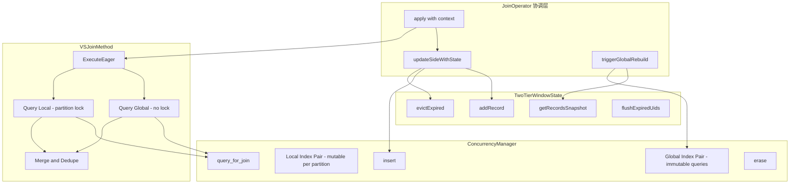
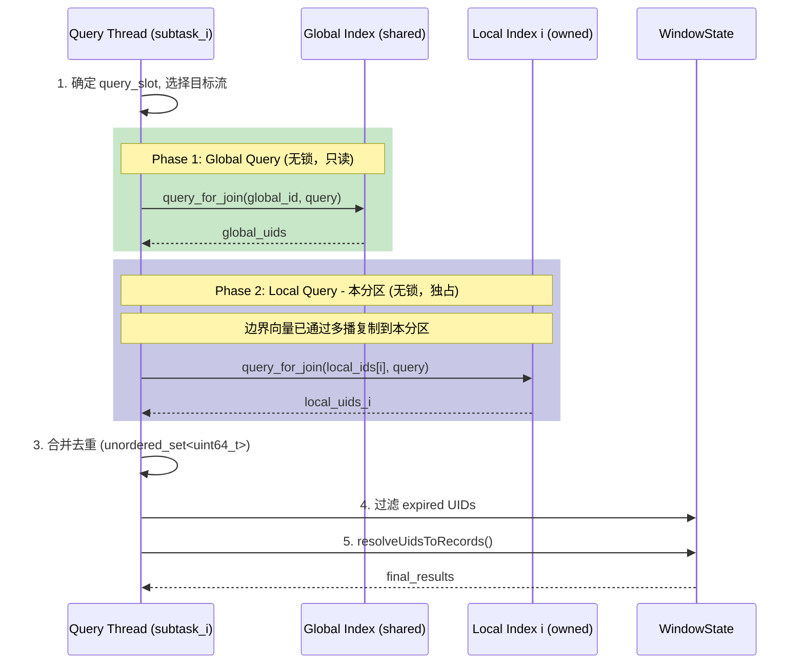
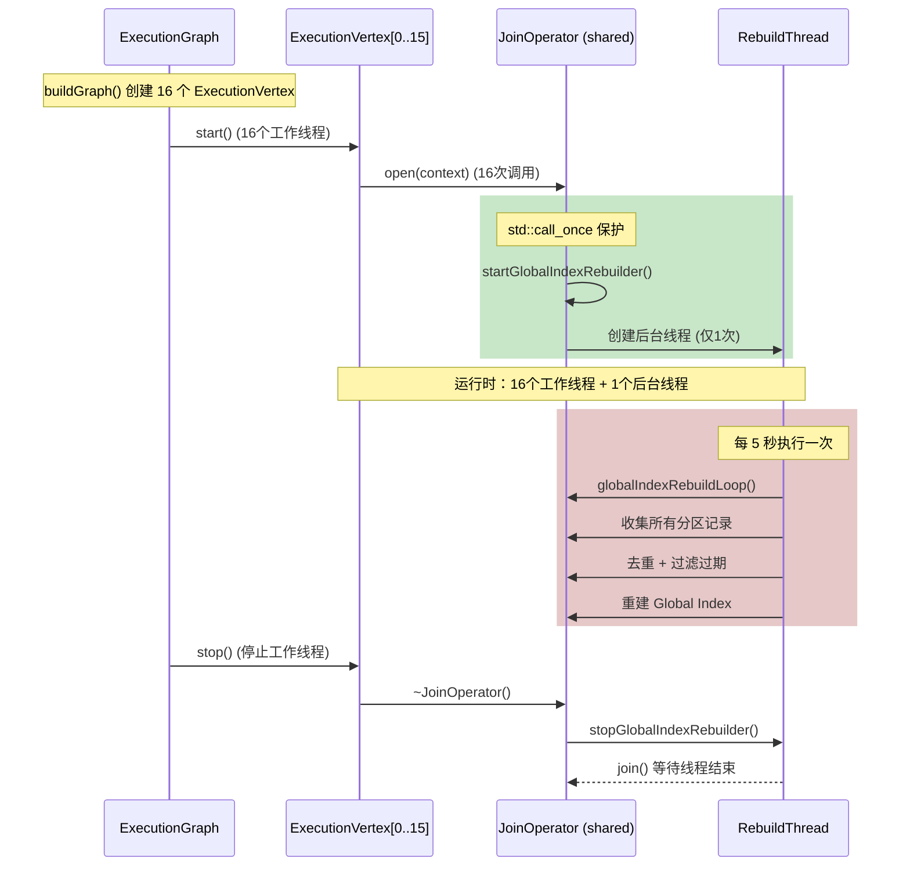

# VSJoin 双层索引架构设计方案（修订版）

## 架构约束遵循

根据 SageFlow 的核心设计原则：

| 组件 | 职责 | VSJoin 中的角色 |

|-----|------|----------------|

| **ConcurrencyManager** | 索引的创建/插入/查询/删除 | 管理 Global + Local 两组索引 |

| **WindowState** | 窗口内向量数据的存储和访问 | 使用 TwoTierWindowState 管理数据 |

| **JoinMethod** | 实现 ExecuteEager() 查询逻辑 | VSJoinMethod 协调双层索引查询 |

| **JoinOperator** | 协调窗口更新、索引插入、Join 执行 | 调用 updateSideWithState + 后台重建触发 |

---

## 1. 整体架构



---

## 2. 索引管理策略（通过 ConcurrencyManager）

### 2.1 索引 ID 布局（方案 B：每分区独立 index_id）

```cpp
// 在 StrategyComponents 中扩展
struct StrategyComponents {
    // ... 现有字段 ...
    
    // Global Immutable Index（所有 subtask 共享，只读查询）
    // 共 2 个 index_id
    int global_left_id = -1;
    int global_right_id = -1;
    
    // Local Mutable Index（每分区独立，完全隔离）
    // 共 2 * num_partitions 个 index_id
    // local_left_ids[partition_i] 对应左流第 i 个分区的索引
    std::vector<int> local_left_ids;   // size = num_partitions
    std::vector<int> local_right_ids;  // size = num_partitions
};
```

**索引总数计算**：

- Global Index: 2 个（左右各一个共享索引）
- Local Index: 2 * num_partitions 个（每流每分区一个独立索引）
- **总计**: 2 + 2 * P 个 index_id（P = parallelism = num_partitions）

### 2.2 索引创建流程（在 JoinStrategyFactory 中）

```cpp
// 修改 JoinStrategyFactory::create() 为 VSJOIN 算法
case JoinAlgorithm::VSJOIN: {
    const int P = static_cast<int>(parallelism);  // 分区数 = 并行度
    
    // 1. 创建 Global Immutable Index（IVF/HNSW，用于快速查询）
    IVFParameters global_ivf_params{
        .nlist = config.ivf_nlist,
        .rebuild_threshold = config.ivf_rebuild_threshold,
        .nprobes = config.ivf_nprobes
    };
    
    components.left_index_id = concurrency_manager->create_index(
        "vsjoin_global_left", IndexType::IVF, config.dimension, global_ivf_params);
    components.right_index_id = concurrency_manager->create_index(
        "vsjoin_global_right", IndexType::IVF, config.dimension, global_ivf_params);
    
    // 2. 创建 Local Mutable Index（每分区独立，完全隔离）
    // 每个分区创建独立的 BruteForce 或轻量级 IVF 索引
    // 分区内只有单线程访问，无需复杂索引结构
    components.local_left_ids.resize(P, -1);
    components.local_right_ids.resize(P, -1);
    
    for (int partition = 0; partition < P; ++partition) {
        // 左流分区索引
        std::string left_name = "vsjoin_local_left_p" + std::to_string(partition);
        components.local_left_ids[partition] = concurrency_manager->create_index(
            left_name, IndexType::BruteForce, config.dimension);
        
        // 右流分区索引
        std::string right_name = "vsjoin_local_right_p" + std::to_string(partition);
        components.local_right_ids[partition] = concurrency_manager->create_index(
            right_name, IndexType::BruteForce, config.dimension);
    }
    
    SAGEFLOW_LOG_INFO("VSJOIN_FACTORY", 
        "Created {} Global indexes + {} Local indexes (parallelism={})",
        2, 2 * P, P);
    break;
}
```

### 2.3 索引访问模式

```
subtask_0 → local_left_ids[0], local_right_ids[0]  // 分区 0 独占
subtask_1 → local_left_ids[1], local_right_ids[1]  // 分区 1 独占
...
subtask_i → local_left_ids[i], local_right_ids[i]  // 分区 i 独占

所有 subtask → global_left_id, global_right_id     // 共享只读
```

**优势**：

- 每个分区的 Local Index 由单一 subtask 独占访问，**写入和查询都无需任何锁**
- 完全隔离，每个分区有独立的 ConcurrencyController（虽然由同一个 ConcurrencyManager 管理）
- 语义清晰：subtask_index == partition_index
- **边界向量通过多播复制**：查询时只查本分区，无需跨分区探测，完全无锁

---

## 3. WindowState 设计

### 3.1 复用 TwoTierWindowState

不需要新建 WindowState，复用现有的 [`TwoTierWindowState`](include/state/two_tier_window_state.h)：

```cpp
// TwoTierWindowState 已有的特性完全满足 VSJoin 需求：
// - 分区存储：每个 subtask 独立的窗口
// - Lazy Delete：标记过期而非立即删除
// - 快照支持：getRecordsSnapshot() 线程安全
// - 批量 Flush：flushExpiredUids() 返回待删除 UID

// 在 JoinStrategyFactory::createWindowState() 中
case WindowStateType::TWO_TIER:
    return std::make_unique<TwoTierWindowState>(parallelism, config.two_tier_compact_threshold);
```

### 3.2 配置推荐

```cpp
// VSJoin 推荐配置
strategy_config_.window_state_type = WindowStateType::TWO_TIER;
strategy_config_.partition_strategy = PartitionStrategy::LSH;
strategy_config_.two_tier_compact_threshold = 100;
```

---

## 4. VSJoinMethod 实现

### 4.1 类定义

创建 [`include/operator/join_operator_methods/vsjoin_method.h`](include/operator/join_operator_methods/vsjoin_method.h)：

**重要说明**：
- 新的 VSJoin 实现将**替换现有的 v1 版本**，使用符合 SageFlow 架构约束的设计（TwoTierWindowState + ConcurrencyManager）。
- v1 版本使用的核心组件（`PartitionedVectorState`, `PartitionedIndex`, `PartitionCoordinator`）**不再需要**。
- v1 版本的 `vsjoin_method.h/cpp` 和相关组件文件将被直接修改或删除。

**文件变更说明**：
- **将被替换的文件**：
  - `include/operator/join_operator_methods/vsjoin_method.h`
  - `src/operator/join_operator_methods/vsjoin_method.cpp`
  - `test/IntegrationTest/test_vsjoin_integration.cpp`
- **已删除的文件**：
  - `include/operator/join_operator_methods/vsjoin_components/async_candidate_generator.h`
  - `include/operator/join_operator_methods/vsjoin_components/distance_verifier.h`

```cpp
class VSJoinMethod : public BaseMethod {
public:
    struct Config {
        double similarity_threshold = 0.8;
        int dimension = 128;
        int num_partitions = 8;
        int multicast_k = 2;  // 边界向量多播到 k 个分区（推荐 2-3）
        
        // 重建策略
        int64_t rebuild_interval_ms = 5000;
        size_t rebuild_threshold = 1000;  // 触发 Global 重建的 Local 索引大小阈值
    };
    
    // ==================== 核心接口 ====================
    
    std::vector<std::unique_ptr<VectorRecord>> ExecuteEager(
        const VectorRecord& query_record,
        int query_slot,
        size_t subtask_index) override;
    
    // ==================== 初始化（由 JoinOperator 调用） ====================
    
    void initialize(const RuntimeContext& context,
                   std::shared_ptr<ConcurrencyManager> concurrency_manager);
    
    // 设置 Global 索引 ID（共享只读，2 个）
    void setGlobalIndexIds(int left_id, int right_id);
    
    // 设置 Local 索引 ID 数组（每分区独立，2 * num_partitions 个）
    void setLocalIndexIds(const std::vector<int>& left_ids, 
                          const std::vector<int>& right_ids);
    
    // 设置 WindowState（由 JoinOperator 传入）
    void setWindowStates(WindowState* left_state, WindowState* right_state);
    
    // 设置分区器（用于确定查询分区和邻近分区）
    void setPartitioner(std::shared_ptr<VectorSpacePartitioner> partitioner);
    
    // ==================== Local Index 访问辅助 ====================
    
    // 获取当前 subtask 对应的 Local Index ID
    int getLocalLeftIndexId(size_t subtask_index) const {
        return (subtask_index < local_left_ids_.size()) 
            ? local_left_ids_[subtask_index] : -1;
    }
    int getLocalRightIndexId(size_t subtask_index) const {
        return (subtask_index < local_right_ids_.size()) 
            ? local_right_ids_[subtask_index] : -1;
    }
    
    // ==================== 重建支持 ====================
    
    bool needsGlobalRebuild(size_t subtask_index) const;
    std::vector<const VectorRecord*> getRecordsForRebuild(size_t subtask_index) const;

private:
    Config config_;
    
    // ConcurrencyManager（用于索引查询，不持有索引）
    std::shared_ptr<ConcurrencyManager> concurrency_manager_;
    
    // Global 索引 ID（共享只读）
    int global_left_id_ = -1;
    int global_right_id_ = -1;
    
    // Local 索引 ID 数组（每分区独立，subtask_i 访问 local_*_ids_[i]）
    std::vector<int> local_left_ids_;   // size = num_partitions
    std::vector<int> local_right_ids_;  // size = num_partitions
    
    // WindowState（由 JoinOperator 传入）
    WindowState* left_state_ = nullptr;
    WindowState* right_state_ = nullptr;
    
    // 分区器（用于确定邻近分区）
    std::shared_ptr<VectorSpacePartitioner> partitioner_;
    
    // ==================== 内部方法 ====================
    
    // 查询 Global Index（无锁，所有 subtask 共享）
    std::vector<uint64_t> queryGlobalIndex(const VectorRecord& query, int target_index_id);
    
    // 查询本分区 Local Index（无锁，独占访问）
    // 注意：不再查询邻近分区，因为边界向量已通过多播复制到本分区
    std::vector<uint64_t> queryLocalIndex(const VectorRecord& query, 
                                          int query_slot,
                                          size_t subtask_index);
    
    // 从 WindowState 解析 UID 到实际记录
    std::vector<std::unique_ptr<VectorRecord>> resolveUidsToRecords(
        const std::vector<uint64_t>& uids, WindowState* state, size_t subtask_index);
};
```

### 4.2 ExecuteEager 实现

```cpp
std::vector<std::unique_ptr<VectorRecord>> VSJoinMethod::ExecuteEager(
    const VectorRecord& query_record,
    int query_slot,
    size_t subtask_index) {
    
    // 确定目标 Global 索引和窗口状态
    int global_target = (query_slot == 0) ? global_right_id_ : global_left_id_;
    WindowState* target_state = (query_slot == 0) ? right_state_ : left_state_;
    
    // ====== 第一阶段：查询 Global Index（无锁） ======
    // Global Index 是只读的，所有 subtask 共享，无需锁
    auto global_uids = queryGlobalIndex(query_record, global_target);
    
    // ====== 第二阶段：查询本分区 Local Index（无锁） ======
    // 注意：不再查询邻近分区，因为边界向量已通过多播复制到本分区
    // 本分区独占访问，完全无锁
    auto local_uids = queryLocalIndex(query_record, query_slot, subtask_index);
    
    // ====== 合并去重 ======
    std::unordered_set<uint64_t> uid_set(global_uids.begin(), global_uids.end());
    for (uint64_t uid : local_uids) {
        uid_set.insert(uid);
    }
    
    // ====== 从 WindowState 获取实际记录 ======
    // 过滤掉已过期的 UID
    std::vector<uint64_t> valid_uids;
    for (uint64_t uid : uid_set) {
        if (!target_state->isExpired(uid, subtask_index)) {
            valid_uids.push_back(uid);
        }
    }
    
    return resolveUidsToRecords(valid_uids, target_state, subtask_index);
}

std::vector<uint64_t> VSJoinMethod::queryGlobalIndex(
    const VectorRecord& query, int target_index_id) {
    
    if (target_index_id < 0 || !concurrency_manager_) {
        return {};
    }
    
    // 通过 ConcurrencyManager 查询（内部处理并发）
    auto candidates = concurrency_manager_->query_for_join(
        target_index_id, query, config_.similarity_threshold, similarity_alpha_);
    
    std::vector<uint64_t> uids;
    for (const auto& c : candidates) {
        uids.push_back(c->uid_);
    }
    return uids;
}

std::vector<uint64_t> VSJoinMethod::queryLocalIndex(
    const VectorRecord& query, int query_slot, size_t subtask_index) {
    
    if (!concurrency_manager_) {
        return {};
    }
    
    // 选择对侧的 Local 索引（只查询本分区）
    // 注意：不再查询邻近分区，因为边界向量已通过多播复制到本分区
    const auto& target_local_ids = (query_slot == 0) 
        ? local_right_ids_ : local_left_ids_;
    
    if (subtask_index >= target_local_ids.size()) {
        return {};
    }
    
    int local_index_id = target_local_ids[subtask_index];
    if (local_index_id < 0) {
        return {};
    }
    
    // 查询本分区的 Local Index（独占访问，无锁）
    auto candidates = concurrency_manager_->query_for_join(
        local_index_id, query, config_.similarity_threshold, similarity_alpha_);
    
    std::vector<uint64_t> uids;
    for (const auto& c : candidates) {
        uids.push_back(c->uid_);
    }
    
    return uids;
}
```

### 4.3 查询流程图（多播方案）



**关键设计点**：

- **不再查询邻近分区**：边界向量通过多播已复制到本分区
- **完全无锁查询**：Global 只读无锁，Local 本分区独占无锁
- **去重在查询结果合并时**：使用 `unordered_set<uint64_t>` 高效去重

---

## 5. JoinOperator 集成

### 5.1 新增成员变量

```cpp
// join_operator.h 新增
class JoinOperator final : public Operator {
private:
    // ... 现有成员 ...
    
    // ==================== VSJoin 专用 ====================
    // Local Index ID 数组（每分区独立）
    std::vector<int> vsjoin_local_left_ids_;   // size = parallelism_
    std::vector<int> vsjoin_local_right_ids_;  // size = parallelism_
    
    // Global Index ID（共享只读）
    int vsjoin_global_left_id_ = -1;
    int vsjoin_global_right_id_ = -1;
};
```

### 5.2 修改 initializeWithStrategyConfig()

```cpp
void JoinOperator::initializeWithStrategyConfig(size_t subtask_index) {
    // ... 现有逻辑 ...
    
    if (strategy_config_.algorithm == JoinAlgorithm::VSJOIN) {
        // 从 StrategyComponents 获取索引 ID
        vsjoin_global_left_id_ = components.left_index_id;
        vsjoin_global_right_id_ = components.right_index_id;
        vsjoin_local_left_ids_ = components.local_left_ids;
        vsjoin_local_right_ids_ = components.local_right_ids;
        
        // 传递给 VSJoinMethod
        auto* vsjoin_method = dynamic_cast<VSJoinMethod*>(join_method_.get());
        if (vsjoin_method) {
            vsjoin_method->setGlobalIndexIds(vsjoin_global_left_id_, vsjoin_global_right_id_);
            vsjoin_method->setLocalIndexIds(vsjoin_local_left_ids_, vsjoin_local_right_ids_);
            vsjoin_method->setWindowStates(left_state_.get(), right_state_.get());
        }
    }
}
```

### 5.3 修改 updateSideWithState()

```cpp
auto JoinOperator::updateSideWithState(..., const RuntimeContext& context) -> bool {
    // ... 现有逻辑 ...
    
    size_t subtask_index = context.subtask_index;
    
    // VSJoin 特殊处理：只插入到本分区的 Local Index
    if (strategy_config_.algorithm == JoinAlgorithm::VSJOIN) {
        // 选择本分区对应的 Local Index ID
        const auto& local_ids = (slot == left_slot_id_) 
            ? vsjoin_local_left_ids_ : vsjoin_local_right_ids_;
        
        int local_index_id = (subtask_index < local_ids.size()) 
            ? local_ids[subtask_index] : -1;
        
        if (local_index_id >= 0 && concurrency_manager_) {
            // 本分区独占访问，无锁插入
            concurrency_manager_->insert(local_index_id, std::move(data_for_index_insert));
        }
        
        // Global Index 不在此处插入，由后台重建线程处理
        SAGEFLOW_LOG_DEBUG("VSJOIN", "subtask_{} inserted to local_id={}", 
                          subtask_index, local_index_id);
    } else {
        // 其他算法的正常插入逻辑
        if (use_index_ && concurrency_manager_ && index_id_for_cc != -1) {
            concurrency_manager_->insert(index_id_for_cc, std::move(data_for_index_insert));
        }
    }
    
    // ... 其余逻辑 ...
}
```

### 5.4 分区路由与多播策略

**重要**：VSJoin 使用 LSH 分区器 + 多播策略，确保边界向量不丢失。

```cpp
// 在 JoinOperator::getPreferredPartitioner() 中
if (strategy_config_.algorithm == JoinAlgorithm::VSJOIN) {
    // 创建 LSH 分区器（支持多播）
    auto lsh_partitioner = std::make_unique<LSHPartitionerAdapter>(
        strategy_config_.dimension,
        strategy_config_.vsjoin_num_hash_functions,
        strategy_config_.vsjoin_boundary_threshold);
    
    // 启用多播（边界向量复制到 k 个分区）
    lsh_partitioner->setMulticastEnabled(true);
    lsh_partitioner->setMulticastK(strategy_config_.vsjoin_multicast_k);
    
    return lsh_partitioner;
}
```

**数据流（多播模式）**：

```
Source → LSHPartitioner (multicast_k=2)
         ├─ 主分区 → subtask_i → Local Index i
         └─ 边界分区 → subtask_j → Local Index j (复制)
```

**多播策略**：

- **非边界向量**：路由到主分区（单播）
- **边界向量**：路由到主分区 + k-1 个邻近分区（多播）
- **查询时**：只查本分区，边界向量已通过多播保证存在

**去重处理**：

- **Local Index**：每个分区独立，无需去重
- **Global Index 重建时**：使用局部 `unordered_set<uint64_t>` 去重（单线程，无锁，详见第 11 章）
- **查询结果合并时**：使用 `unordered_set<uint64_t>` 去重（O(n) 开销，n 通常 < 1000）

### 5.2 后台重建机制（线程管理设计）

#### 5.2.1 线程模型

**关键设计决策**：

- **保持现有固定线程模型**：不需要改造成线程池
- **线程数量**：并行度 P = 16 → **16个工作线程 + 1个后台线程 = 17个线程**
- **管理方式**：在 `JoinOperator` 内部管理，使用 `std::call_once` 确保只启动一次

**线程分配**：

```
并行度 P = 16
├─ ExecutionVertex[0..15] → 16个工作线程（处理数据流）
└─ GlobalIndexRebuilder → 1个后台线程（周期性重建）
─────────────────────────────────────────────
总计：17个线程
```

#### 5.2.2 实现设计

**在 `join_operator.h` 中添加**：

```cpp
class JoinOperator final : public Operator {
private:
    // ... 现有成员 ...
    
    // ==================== VSJoin 后台重建 ====================
    // 使用 std::call_once 确保只启动一次（所有 subtask 共享同一个 JoinOperator 实例）
    std::once_flag rebuild_thread_started_;
    std::unique_ptr<std::thread> rebuild_thread_;
    std::atomic<bool> rebuild_running_{false};
    std::atomic<int64_t> rebuild_interval_ms_{5000};
    
    // 后台重建循环
    void globalIndexRebuildLoop();
    
    // 启动后台重建线程（由 open() 调用，使用 call_once 保护）
    void startGlobalIndexRebuilder();
    
    // 停止后台重建线程（由析构函数调用）
    void stopGlobalIndexRebuilder();
};
```

**在 `join_operator.cpp` 中实现**：

```cpp
void JoinOperator::open(const RuntimeContext& context) {
    // ... 现有逻辑 ...
    
    // VSJoin 特殊处理：启动后台重建线程
    if (strategy_config_.algorithm == JoinAlgorithm::VSJOIN) {
        startGlobalIndexRebuilder();
    }
}

void JoinOperator::startGlobalIndexRebuilder() {
    // 使用 std::call_once 确保只启动一次（所有 subtask 共享同一个 JoinOperator）
    std::call_once(rebuild_thread_started_, [this]() {
        rebuild_running_ = true;
        rebuild_interval_ms_ = strategy_config_.vsjoin_rebuild_interval_ms;
        
        rebuild_thread_ = std::make_unique<std::thread>(
            &JoinOperator::globalIndexRebuildLoop, this);
        
        SAGEFLOW_LOG_INFO("VSJOIN_REBUILDER", 
            "Background rebuild thread started (interval={}ms, parallelism={})",
            rebuild_interval_ms_.load(), parallelism_);
    });
}

void JoinOperator::stopGlobalIndexRebuilder() {
    if (rebuild_running_.exchange(false)) {
        if (rebuild_thread_ && rebuild_thread_->joinable()) {
            rebuild_thread_->join();
        }
        SAGEFLOW_LOG_INFO("VSJOIN_REBUILDER", "Background rebuild thread stopped");
    }
}

void JoinOperator::globalIndexRebuildLoop() {
    const int64_t interval_ms = rebuild_interval_ms_.load();
    
    while (rebuild_running_.load()) {
        std::this_thread::sleep_for(std::chrono::milliseconds(interval_ms));
        
        if (!rebuild_running_.load()) break;
        
        // ====== 1. 从所有 WindowState 分区收集活跃记录（多播导致重复） ======
        // ⚠️ 关键设计点：去重使用局部 unordered_set，完全局限在重建线程内，无锁无竞争
        // 详见第 11 章"全局重建去重机制设计"
        std::unordered_set<uint64_t> seen_left_uids;   // 局部容器，不对外共享
        std::unordered_set<uint64_t> seen_right_uids;  // 局部容器，不对外共享
        std::vector<const VectorRecord*> unique_left_records;
        std::vector<const VectorRecord*> unique_right_records;
        
        for (size_t p = 0; p < parallelism_; ++p) {
            // 获取分区快照（线程安全）
            auto left_snapshot = left_state_->getRecordsSnapshot(p);
            auto right_snapshot = right_state_->getRecordsSnapshot(p);
            
            for (const auto& r : left_snapshot) {
                if (seen_left_uids.insert(r->uid_).second) {  // 首次出现
                    unique_left_records.push_back(r.get());
                }
            }
            
            for (const auto& r : right_snapshot) {
                if (seen_right_uids.insert(r->uid_).second) {
                    unique_right_records.push_back(r.get());
                }
            }
        }
        
        // ====== 2. 过滤已过期的记录 ======
        int64_t now = std::chrono::duration_cast<std::chrono::milliseconds>(
            std::chrono::system_clock::now().time_since_epoch()).count();
        int64_t window_lower = logicalWindowLowerBound(now);
        
        std::vector<const VectorRecord*> valid_left_records;
        std::vector<const VectorRecord*> valid_right_records;
        
        for (const auto* r : unique_left_records) {
            if (r->timestamp_ >= window_lower) {
                valid_left_records.push_back(r);
            }
        }
        for (const auto* r : unique_right_records) {
            if (r->timestamp_ >= window_lower) {
                valid_right_records.push_back(r);
            }
        }
        
        // ====== 3. 构建新的 Global Index（离线） ======
        // 注意：需要从 StorageManager 获取实际向量数据
        // 这里简化处理，实际需要：
        // - 创建新的 IVF 索引
        // - 批量插入 valid_*_records
        // - 原子替换旧索引
        
        // ====== 4. 原子替换旧 Index ======
        // TODO: 实现索引原子替换逻辑
        // concurrency_manager_->replaceIndex(vsjoin_global_left_id_, new_left_index);
        // concurrency_manager_->replaceIndex(vsjoin_global_right_id_, new_right_index);
        
        // ====== 5. 清理 Local Index 中已合并的记录 ======
        // 可选：清理 Local Index 中已过期或已合并到 Global 的记录
        
        SAGEFLOW_LOG_INFO("VSJOIN_REBUILD", 
            "Global index rebuilt: {} unique left ({} valid), {} unique right ({} valid)",
            unique_left_records.size(), valid_left_records.size(),
            unique_right_records.size(), valid_right_records.size());
    }
}

JoinOperator::~JoinOperator() {
    // ... 现有逻辑 ...
    
    // 停止后台重建线程
    stopGlobalIndexRebuilder();
}
```

#### 5.2.3 线程生命周期管理



#### 5.2.4 关键设计点

| 设计点 | 决策 | 原因 |

|-------|------|------|

| **线程数量** | P + 1（16 + 1 = 17） | 保持固定线程模型，不改造线程池 |

| **启动时机** | `open()` 中使用 `std::call_once` | 所有 subtask 共享同一个 JoinOperator，确保只启动一次 |

| **停止时机** | `~JoinOperator()` 析构时 | 与 JoinOperator 生命周期绑定 |

| **线程安全** | `std::atomic<bool>` 控制停止 | 后台线程安全退出 |

| **数据访问** | 通过 `WindowState::getRecordsSnapshot()` | 线程安全的快照接口 |

#### 5.2.5 与现有框架的集成

**不需要改造线程池**：

- ✅ 保持现有的固定线程模型（每个 ExecutionVertex 一个线程）
- ✅ 后台线程作为 JoinOperator 的附加线程，不影响执行图结构
- ✅ 使用 `std::call_once` 确保线程安全启动
- ✅ 生命周期与 JoinOperator 绑定，无需额外管理

**优势**：

1. **最小侵入**：只在 JoinOperator 内部添加，不影响 ExecutionGraph
2. **线程安全**：使用 `std::call_once` 和 `std::atomic` 保证安全
3. **易于管理**：生命周期清晰，与 JoinOperator 绑定
4. **性能可控**：后台线程独立，不影响工作线程性能

---

## 6. 配置扩展

### 6.1 JoinStrategyConfig 新增字段

```cpp
 // include/operator/utils/join_strategy_config.h
struct JoinStrategyConfig {
    // ... 现有字段 ...
    
    // ==================== VSJoin 参数 ====================
    int vsjoin_multicast_k = 2;             // 边界向量多播到 k 个分区（推荐 2-3）
    int64_t vsjoin_rebuild_interval_ms = 5000;  // Global 重建间隔
    size_t vsjoin_rebuild_threshold = 1000;     // 触发重建的阈值
    
    // Local Index 参数（比 Global 更轻量）
    // 注意：Local Index 使用 BruteForce，无需 nlist/nprobes
    IndexType vsjoin_local_index_type = IndexType::BruteForce;
    
    // Global Index 类型（IVF/HNSW）
    IndexType vsjoin_global_index_type = IndexType::IVF;
};
```

---

## 7. 实现路线图

| 阶段 | 任务 | 关键文件 | 预估工时 |

|-----|------|---------|---------|

| **P1** | VSJoinMethod 基础实现 | `vsjoin_method.h/cpp` | 2天 |

| **P2** | JoinStrategyFactory 集成 | `join_strategy_factory.cpp` | 1天 |

| **P3** | JoinOperator VSJoin 特殊路径 | `join_operator.cpp` | 1天 |

| **P4** | 后台重建机制 | `global_index_rebuilder.h/cpp` | 1.5天 |

| **P5** | 配置验证 + TOML 解析 | `join_config_validator.cpp`, `join_strategy_config.cpp` | 0.5天 |

| **P6** | 集成测试 | `test_vsjoin_integration.cpp` | 1天 |

**总预估：7 个工作日**

---

## 8. 关键设计决策总结

| 设计点 | 决策 | 原因 |

|-------|------|------|

| 索引管理 | 通过 ConcurrencyManager | 遵循架构约束，索引生命周期统一管理 |

| 窗口数据 | 复用 TwoTierWindowState | 已有分区存储 + Lazy Delete 特性 |

| Global Index 更新 | 后台线程周期性重建 | 避免写锁，保持查询无锁 |

| **Local Index 策略** | **每分区独立 index_id** | **完全隔离，无锁独占，语义清晰** |

| JoinMethod 职责 | 只负责查询协调 | 遵循单一职责，不管理索引生命周期 |

| **边界向量处理** | **多播 + 去重** | **写入时多播到 k 个分区，查询时只查本分区，完全无锁** |

| 分区路由 | LSH Partitioner + Multicast | 相似向量路由到主分区，边界向量多播保证召回率 |

| 去重策略 | 查询结果合并时 UID 去重 | O(n) 开销，n 通常 < 1000，性能影响可忽略 |

---

## 9. 多播 vs 邻近分区探测方案对比

### 9.1 方案选择：多播 + 去重（推荐）

| 维度 | 多播 + 去重 | 邻近分区探测 + 不去重 |

|-----|-----------|-------------------|

| **写入路径** | 边界向量多播到 k 个分区 | 单分区写入 |

| **查询路径** | 只查本分区（无锁） | 本分区 + 邻近分区（需要锁） |

| **存储开销** | k 倍（边界向量，通常 < 20%） | 1 倍 |

| **并发控制** | 本分区无锁写入 | 邻近分区查询需要读锁 |

| **Global Index 去重** | 需要（UID 去重，O(n)） | 不需要 |

| **召回率** | 高（边界向量不丢失） | 依赖探测范围 |

| **查询延迟** | 低（单分区查询） | 较高（多分区查询） |

| **多核扩展性** | 高（完全隔离） | 中（跨分区锁竞争） |

**推荐理由**：

1. ✅ **符合 VSJoin 目标**：无锁/低锁更新、多核扩展性、读写解耦
2. ✅ **查询路径简单**：只查本分区，无跨分区锁竞争
3. ✅ **去重成本低**：查询结果合并时用 `unordered_set<uint64_t>` 去重，O(n) 开销
4. ✅ **已有实现参考**：`CentroidPartitioner` 已支持多播

### 9.2 去重策略设计

**去重时机**：

1. **查询结果合并时**（VSJoinMethod::ExecuteEager）
   ```cpp
   std::unordered_set<uint64_t> uid_set;
   for (uint64_t uid : global_uids) uid_set.insert(uid);
   for (uint64_t uid : local_uids) uid_set.insert(uid);
   ```


   - 开销：O(n)，n 通常 < 1000
   - 性能影响：可忽略（< 1ms）

2. **Global Index 重建时**（GlobalIndexRebuilder）
   ```cpp
   std::unordered_set<uint64_t> seen_uids;
   for (auto& record : all_records) {
       if (seen_uids.insert(record->uid_).second) {
           unique_records.push_back(record);
       }
   }
   ```


   - 开销：O(n)，n = 窗口内总记录数
   - 频率：每 5 秒一次（可配置）

**去重性能分析**：

- 典型场景：1000 条记录，10% 边界向量（多播 k=2）
- 重复记录数：~100 条
- 去重开销：`unordered_set` 插入 100 次 ≈ 0.01ms
- **结论**：去重开销可忽略不计

---

## 10. Local Index 方案 B 的优势分析

选择方案 B（每分区独立 index_id）的优势：

| 特性 | 方案 A (PartitionedIndex) | 方案 B (独立 index_id) |

|-----|---------------------------|----------------------|

| 索引隔离 | 分区级锁 | **完全隔离，无锁** |

| ConcurrencyController | 共享一个 | **每分区独立** |

| 语义清晰度 | 隐式分区 | **subtask_i ↔ index_i** |

| 索引数量 | 2 + 2 | 2 + 2*P |

| 管理复杂度 | 低 | 中等 |

| 扩展性 | 受限于内部实现 | **灵活，可独立调整** |

**为何选择方案 B**：

1. **无锁本分区访问**：subtask_i 独占 `local_*_ids[i]`，插入/查询无需任何同步
2. **故障隔离**：一个分区的索引问题不影响其他分区
3. **独立调优**：可以为不同分区配置不同的索引参数
4. **符合 VSJoin Key Idea**：真正实现"分区独立"的设计理念

---

## 11. 全局重建去重机制设计

### 11.1 问题背景

- **多播带来的重复**：边界向量会被复制到多个分区 → WindowState / Local Index 中存在 UID 重复
- **Global Index 重建需求**：后台线程从所有分区的 WindowState 快照中收集记录，需要去重后再重建全局索引
- **去重约束**：
  - 去重逻辑封装在 Join 层内部，不下推到 sink
  - 去重结构需要在多线程可读场景下无锁或低锁，避免锁竞争
  - 需要兼容分布式 UID 生成与多播复制（同一 UID 出现在多个分区）

### 11.2 设计方案：后台线程内局部 `unordered_set` 去重（推荐）

**核心思想**：

- **重建是单线程行为**：`GlobalIndexRebuilder` 后台线程是单线程的，读取 WindowState 快照本身已通过内部锁/快照机制保证线程安全
- **局部容器去重**：在单线程循环内部使用 `std::unordered_set<uint64_t>` 去重 **不会有锁竞争**，因为没有并发写
- **关键约束**：**不对外共享这些 set**，确保它们完全局限在重建线程内

**实现要点**（已在第 5.2.2 节实现）：

```cpp
void JoinOperator::globalIndexRebuildLoop() {
    // ...
    // ⚠️ 关键：seen_*_uids 是局部变量，完全局限在重建线程内
    std::unordered_set<uint64_t> seen_left_uids;   // 局部容器，不对外共享
    std::unordered_set<uint64_t> seen_right_uids;  // 局部容器，不对外共享
    
    for (size_t p = 0; p < parallelism_; ++p) {
        auto left_snapshot = left_state_->getRecordsSnapshot(p);
        for (const auto& r : left_snapshot) {
            if (seen_left_uids.insert(r->uid_).second) {  // 首次出现
                unique_left_records.push_back(r.get());
            }
        }
        // ... 右流同理
    }
    // ...
}
```

**优势**：

- ✅ **0 共享状态，0 加锁**：完全无锁，无并发竞争
- ✅ **复杂度 O(N)**：N = 窗口内记录数，且重建间隔可配置（默认 5s）
- ✅ **实现简单**：直接使用标准库容器，无需额外同步机制

**结论**：

- 若 Global 重建只在单线程中运行，则 **无需额外原子 bitmap / 全局哈希表**，直接在重建线程内用局部 `unordered_set` 去重已经满足「无锁 + 易实现」目标

### 11.3 替代方案：全局 UID Bitmap 去重（预留，未来扩展）

**适用场景**（当前不需要，但为未来扩展预留）：

- 多个重建线程并行工作
- 更细粒度的增量重建（边走边去重）

**设计要点**：

- 使用 `std::vector<std::atomic<uint64_t>> bitmap_`，每个 `uint64_t` 管理 64 个 bit
- 设置 bit 时使用 `fetch_or`：`old = bitmap_[word].fetch_or(mask, std::memory_order_acq_rel);`
- 如果 `(old & mask) == 0`，说明该 UID 是 **第一次出现**

**接口设计**（预留，暂不实现）：

```cpp
class VSJoinUidBitmap {
public:
    bool tryMark(uint64_t uid);  // 返回 true 表示首次出现
    void resetAll();              // 清空 bitmap（全量重建前调用）
};
```

### 11.4 查询阶段的 UID 去重（Global + Local 合并）

**场景**：

- 查询时，VSJoinMethod 会分别从 Global Index 和 Local Index 拿到一批 UID，两批之间可能有交集
- 需求是 **在 JoinMethod 内部完成去重**，不让重复向下游 sink 泄露

**实现**（已在第 4.2 节实现）：

```cpp
// VSJoinMethod::ExecuteEager
std::unordered_set<uint64_t> uid_set(global_uids.begin(), global_uids.end());
for (uint64_t uid : local_uids) {
    uid_set.insert(uid);
}
```

**性能分析**：

- 这是在 **单次查询调用的线程上下文内** 完成，局部容器，无需加锁
- 每次查询典型候选数 < 1000，`unordered_set` 的 O(n) 开销可以忽略（< 1ms）

---

## 12. 分区负载均衡组件设计

### 12.1 问题背景

- **负载不均问题**：LSH 分区 + 多播策略下，实际数据分布往往高度偏斜，部分 LSH bucket 流量远高于其他区域
- **当前限制**：每个 ExecutionVertex（subtask）固定绑定一个 partition index，即 `subtask_index == partition_index`，映射是静态的
- **目标**：在不改变 ExecutionGraph 线程模型的前提下，引入轻量的负载均衡机制

### 12.2 设计原则

- ✅ **不改 ExecutionGraph 的线程模型**：每个 ExecutionVertex 依然是 1 个线程
- ✅ **不改 WindowState 抽象**：依然通过 `WindowState` 管理窗口记录
- ✅ **VSJoin 内部引入一层 "logical partition" → "physical subtask" 的映射**
- ✅ **保证每个 logical partition 最终只被一个物理 subtask 写入**，以保持 Local Index 与 WindowState 的线程安全假设（单线程）

### 12.3 方案：LogicalPartition + AssignmentTable (RCU) + LoadMonitor

#### 12.3.1 Logical Partition 拆分

**核心思路**：

- 将原本直接使用 `num_partitions = P` 的 LSH 分区，扩展成 `logical_partitions = P * V` 个 **逻辑分区**（V 为每个物理分区的虚拟节点数，比如 8 或 16）
- `LSHPartitionerAdapter` 输出的不是 `[0, P)`，而是 `[0, P*V)` 的 logical partition id
- 每个 logical partition 内依然保证「相似向量被路由到相同或邻近 logical partition」的性质

**映射关系**：

```
LSH Hash → logical_pid [0, P*V) → AssignmentTable → physical_subtask [0, P)
```

#### 12.3.2 AssignmentTable：逻辑分区到物理 subtask 的映射（RCU 并发安全设计）

**并发访问模式**：

- **读操作（高频）**：每个 subtask 在处理每条记录时都需要查询 `logical_to_physical[logical_pid]`，这是 **多线程并发读**，频率极高（每条记录一次）
- **写操作（低频）**：由负载均衡器（后台线程）定期调整 logical partition 到 physical subtask 的映射，频率低（每几秒一次），但可能需要 **批量更新多个 logical partition**

**并发安全方案对比**：

| 方案 | 读性能 | 写性能 | 批量更新原子性 | 内存开销 | 复杂度 |
|------|--------|--------|----------------|----------|--------|
| `std::atomic<int>*` 数组 | 高（无锁 load） | 中（单元素原子更新） | ❌ 无法保证批量原子性 | 低 | 低 |
| **RCU (Read-Copy-Update)** | **最高（完全无锁）** | 中（双缓冲切换） | ✅ 批量更新原子性 | 中（双倍映射表） | 中 |
| `std::shared_mutex` | 中（shared_lock） | 低（unique_lock 阻塞读） | ✅ 批量更新原子性 | 低 | 低 |

**推荐方案：RCU (Read-Copy-Update)**

**实现设计**：

```cpp
// include/operator/join_operator_methods/vsjoin_components/partition_assignment.h
class VSJoinPartitionAssignment {
public:
    explicit VSJoinPartitionAssignment(size_t num_logical_partitions, size_t num_physical_subtasks)
        : num_logical_(num_logical_partitions),
          num_physical_(num_physical_subtasks),
          current_table_(std::make_unique<std::vector<int>>(num_logical_, 0)),
          next_table_(std::make_unique<std::vector<int>>(num_logical_, 0)),
          current_ptr_(current_table_.get()) {
        // 初始化：简单轮询分配
        for (size_t i = 0; i < num_logical_; ++i) {
            (*current_table_)[i] = static_cast<int>(i % num_physical_);
            (*next_table_)[i] = static_cast<int>(i % num_physical_);
        }
    }

    // ==================== 读操作（高频，完全无锁） ====================
    int getPhysicalSubtask(int logical_pid) const {
        // 原子读取当前指针（memory_order_acquire 确保看到最新的映射表）
        std::vector<int>* table = current_ptr_.load(std::memory_order_acquire);
        
        if (logical_pid < 0 || static_cast<size_t>(logical_pid) >= num_logical_) {
            return -1;
        }
        
        // 直接访问数组元素（无锁，因为 table 本身不会被修改，只会被替换）
        return (*table)[logical_pid];
    }

    // ==================== 写操作（低频，批量更新） ====================
    void updateMapping(const std::vector<std::pair<int, int>>& updates) {
        // 1. 在 next_table_ 上准备新映射（复制当前版本）
        {
            std::lock_guard<std::mutex> lock(write_mutex_);
            *next_table_ = *current_table_;  // 复制当前版本（O(N)，但 N = P*V 通常 < 1024）
            
            // 2. 应用批量更新
            for (const auto& [logical_pid, physical_subtask] : updates) {
                if (logical_pid >= 0 && static_cast<size_t>(logical_pid) < num_logical_ &&
                    physical_subtask >= 0 && static_cast<size_t>(physical_subtask) < num_physical_) {
                    (*next_table_)[logical_pid] = physical_subtask;
                }
            }
        }
        
        // 3. 原子切换指针（memory_order_release 确保新映射表对所有后续读操作可见）
        current_ptr_.store(next_table_.get(), std::memory_order_release);
        
        // 4. 交换指针，为下次更新做准备（避免每次都重新分配内存）
        std::swap(current_table_, next_table_);
    }

    // 单元素更新（批量更新的特例）
    void setPhysicalSubtask(int logical_pid, int physical_subtask) {
        updateMapping({{logical_pid, physical_subtask}});
    }

private:
    size_t num_logical_;
    size_t num_physical_;
    
    // 双缓冲：两个映射表实例
    std::unique_ptr<std::vector<int>> current_table_;  // 当前版本（读）
    std::unique_ptr<std::vector<int>> next_table_;      // 准备版本（写）
    
    // 原子指针：指向当前可读的映射表
    std::atomic<std::vector<int>*> current_ptr_;
    
    // 写互斥锁：保护 next_table_ 的更新过程（避免并发写冲突）
    mutable std::mutex write_mutex_;
};
```

**关键设计点**：

1. **避免大规模内存拷贝**：
   - 映射表本身很小：`P*V * sizeof(int)`，例如 `128 * 8 * 4 = 4KB`
   - 只在更新时复制一次（`*next_table_ = *current_table_`），开销可接受
   - 使用 `std::swap` 交换指针，避免重复分配内存

2. **读操作完全无锁**：
   - `current_ptr_.load()` 是原子操作，但开销极小（通常就是一次普通 load）
   - 读取数组元素 `(*table)[logical_pid]` 是普通内存访问，无锁
   - 即使写操作正在进行，读操作也不会被阻塞

3. **批量更新原子性**：
   - 所有更新都在 `next_table_` 上完成，然后通过一次原子指针切换让所有读操作看到新版本
   - 读操作要么看到旧版本，要么看到新版本，不会看到"部分更新"的状态

4. **内存安全**：
   - `current_table_` 和 `next_table_` 的生命周期由 `VSJoinPartitionAssignment` 管理，不会被提前释放
   - 指针切换后，旧版本会被保留在 `next_table_` 中，直到下次更新时被覆盖（无需引用计数，因为写操作频率低）

**性能分析**：

- **读操作开销**：1 次原子 load（~1ns） + 1 次数组访问（~1ns） = **~2ns**，完全无锁
- **写操作开销**：复制映射表（~1μs for 1KB）+ 批量更新（O(K)，K=更新数量） + 原子指针切换（~1ns）
- **内存开销**：双倍映射表 = `2 * P*V * sizeof(int)`，例如 `2 * 1024 * 4 = 8KB`，可接受

#### 12.3.3 LoadMonitor：采样负载信息

**设计要点**：

- 在 JoinOperator 中增加一个轻量的 `VSJoinLoadMonitor`
- 每个 subtask 周期性（例如每 N 条记录或每 100ms）上报：
  - 最近窗口内的输入记录数
  - 平均处理时延（可选）
  - 当前队列 backlog（如能获取）
- JoinOperator 统一维护一个 `std::vector<LoadStat> subtask_load;`
- 后台的 `GlobalIndexRebuilder` 线程或独立的 `VSJoinBalancer` 定期（每几秒）读取负载统计，判断是否需要调整 logical partition 分配

**LoadStat 结构**：

```cpp
struct LoadStat {
    size_t subtask_index;
    size_t record_count;        // 最近窗口内的输入记录数
    double avg_latency_ms;      // 平均处理时延（可选）
    size_t queue_backlog;       // 当前队列 backlog（如能获取）
    std::chrono::steady_clock::time_point last_update;
};
```

#### 12.3.4 路由流程

**写入/查询流程**：

1. Source → LSHPartitioner：根据向量算出 logical partition id（含多播逻辑，返回 1 个主 logical pid + 若干邻近 pid）
2. 对每个 logical pid：通过 `VSJoinPartitionAssignment` 取得 physical subtask：`physical = logical_to_physical[logical_pid]`
3. 将记录递交给对应的 ExecutionVertex（subtask）的输入队列，由该线程更新 WindowState 和 Local Index
4. 查询时：
   - 查询向量同样经过 LSHPartitioner 得到一个 logical pid
   - 通过 `VSJoinPartitionAssignment` 找到当前负责该 pid 的 subtask 及其 Local Index，执行查询

#### 12.3.5 替代方案：Global 查询任务窃取（Work Stealing，可选优化）

**核心思想**：

- 将查询任务拆分为两部分：
  1. **Global Index 查询**：查询共享的 Global Index（无分区语义，任何线程执行结果相同）
  2. **Local Index 查询**：查询本分区的 Local Index（必须由本分区线程执行）
- **空闲线程可以"窃取"其他忙线程的 Global 查询任务**，忙线程只需等待 Global 查询完成后，执行 Local 查询并合并结果

**方案对比**：

| 维度 | Logical Partition + RCU | Global 查询窃取 |
|------|------------------------|-----------------|
| **均衡粒度** | 粗粒度（调整 logical partition 分配） | 细粒度（单个查询任务级别） |
| **实现复杂度** | 中（RCU + AssignmentTable） | 高（任务队列 + 工作窃取 + 结果合并） |
| **性能提升** | 对长期负载不均有效 | 对短期热点查询有效 |
| **适用场景** | 数据分布长期偏斜 | Global 查询耗时占比高（> 30%） |
| **框架侵入性** | 低（只影响路由层） | 中（需要任务队列机制） |
| **内存开销** | 低（双倍映射表 ~8KB） | 中（任务队列 + Future 开销） |

**推荐决策**：

- **优先实现 Logical Partition + RCU**：更符合 VSJoin 的架构理念（分区独立），实现相对简单，对长期负载不均有效
- **Global 查询窃取作为可选优化**：如果实测发现 Global 查询耗时占比高（> 30%），且分区负载高度倾斜，再考虑实现工作窃取机制

#### 12.3.6 第一版落地范围（控制复杂度）

**分阶段实现**：

- **Phase B1（观测期）**：
  - 实现 `VSJoinLoadMonitor`，记录各 subtask 的 load 信息，但暂不真正迁移 logical partition
  - 通过日志或测试工具观察负载不均程度，为后续调参提供依据

- **Phase B2（静态重新分配 + RCU AssignmentTable）**：
  - 实现 `VSJoinPartitionAssignment`（RCU 方案），支持启动阶段根据历史/配置做 static mapping（例如冷热分离）
  - 不在运行期动态调整，但为 Phase B3 预留接口

- **Phase B3（运行期动态调整）**：
  - 增加 `VSJoinBalancer`，在 GlobalIndexRebuilder 的后台线程中顺带执行简单的 rebalancing 策略
  - 调用 `VSJoinPartitionAssignment::updateMapping()` 批量更新映射

---

## 13. 关键设计要点与注意事项

### 13.1 并发安全保证

#### 13.1.1 Global Index 重建去重

- ⚠️ **必须使用局部容器**：`seen_left_uids` 和 `seen_right_uids` 必须是 `globalIndexRebuildLoop()` 的局部变量，不对外共享
- ⚠️ **单线程约束**：Global 重建是单线程行为，确保去重逻辑完全无锁
- ✅ **性能可接受**：O(N) 复杂度，N = 窗口内记录数，重建间隔可配置（默认 5s）

#### 13.1.2 AssignmentTable 并发访问

- ⚠️ **必须使用 RCU 方案**：读操作完全无锁（`atomic_ptr.load()` + 数组访问），写操作通过原子指针切换保证批量更新原子性
- ⚠️ **内存拷贝开销**：映射表小（~4KB），只在更新时复制一次，使用 `std::swap` 避免重复分配
- ⚠️ **内存可见性**：使用 `std::memory_order_acquire/release` 保证内存可见性

#### 13.1.3 Local Index 访问

- ✅ **完全无锁**：每个分区的 Local Index 由单一 subtask 独占访问，写入和查询都无需任何锁
- ⚠️ **分区隔离**：确保 `subtask_index == partition_index`，每个 subtask 只访问 `local_*_ids[subtask_index]`

### 13.2 多播与去重

#### 13.2.1 多播策略

- ⚠️ **边界向量多播**：边界向量会被复制到 k 个分区（推荐 k=2-3），导致 WindowState / Local Index 中存在 UID 重复
- ✅ **查询时只查本分区**：边界向量已通过多播保证存在，查询时无需跨分区探测，完全无锁
- ⚠️ **存储开销**：k 倍存储（边界向量，通常 < 20%），可接受

#### 13.2.2 去重时机

- ✅ **查询结果合并时**：使用 `unordered_set<uint64_t>` 去重，O(n) 开销，n 通常 < 1000，性能影响可忽略
- ✅ **Global Index 重建时**：使用局部 `unordered_set<uint64_t>` 去重，单线程，完全无锁

### 13.3 索引管理

#### 13.3.1 索引创建

- ⚠️ **索引总数**：2 + 2 * P 个 index_id（P = parallelism）
  - Global Index: 2 个（左右各一个共享索引）
  - Local Index: 2 * P 个（每流每分区一个独立索引）
- ⚠️ **索引类型**：
  - Global Index: IVF/HNSW（快速查询）
  - Local Index: BruteForce（轻量级，分区内单线程访问）

#### 13.3.2 索引更新

- ⚠️ **Local Index**：实时插入，由 `updateSideWithState()` 直接插入到本分区的 Local Index
- ⚠️ **Global Index**：后台线程周期性重建，不在此处插入，避免写锁

### 13.4 线程模型

#### 13.4.1 线程数量

- ⚠️ **固定线程模型**：P + 1 个线程（P 个工作线程 + 1 个后台重建线程）
- ⚠️ **启动时机**：使用 `std::call_once` 确保后台重建线程只启动一次（所有 subtask 共享同一个 JoinOperator）
- ⚠️ **停止时机**：`~JoinOperator()` 析构时停止后台重建线程

#### 13.4.2 线程安全

- ✅ **WindowState 快照**：通过 `getRecordsSnapshot()` 获取线程安全的快照
- ✅ **原子操作**：使用 `std::atomic<bool>` 控制后台线程停止，使用 `std::atomic<std::vector<int>*>` 实现 RCU

### 13.5 负载均衡（可选）

#### 13.5.1 Logical Partition

- ⚠️ **第一版不强制实现**：可以先实现观测和静态分配，动态调整作为后续优化
- ⚠️ **RCU 必须实现**：如果实现 AssignmentTable，必须使用 RCU 方案保证并发安全
- ⚠️ **内存开销**：双倍映射表（~8KB），可接受

#### 13.5.2 Global 查询窃取

- ⚠️ **第一版不实现**：作为可选优化，仅在 Global 查询耗时占比高时考虑
- ⚠️ **实现复杂度高**：需要任务队列、工作窃取、结果合并等机制

### 13.6 配置与测试

#### 13.6.1 推荐配置

```cpp
strategy_config_.window_state_type = WindowStateType::TWO_TIER;
strategy_config_.partition_strategy = PartitionStrategy::LSH;
strategy_config_.two_tier_compact_threshold = 100;
strategy_config_.vsjoin_multicast_k = 2;  // 推荐 2-3
strategy_config_.vsjoin_rebuild_interval_ms = 5000;
strategy_config_.vsjoin_rebuild_threshold = 1000;
```

#### 13.6.2 测试要点

- ✅ **召回率验证**：确保多播策略下边界向量不丢失
- ✅ **去重验证**：确保 Global Index 重建和查询结果合并时正确去重
- ✅ **并发安全测试**：多线程场景下 AssignmentTable 的读操作无锁，写操作原子性
- ✅ **负载均衡测试**：Logical Partition 分配调整后，负载是否均衡

---

## 14. 实现路线图（更新版）

| 阶段 | 任务 | 关键文件 | 预估工时 | 依赖 |
|-----|------|---------|---------|------|
| **P1** | VSJoinMethod 基础实现 | `vsjoin_method.h/cpp` | 2天 | - |
| **P2** | JoinStrategyFactory 集成 | `join_strategy_factory.cpp` | 1天 | P1 |
| **P3** | JoinOperator VSJoin 特殊路径 | `join_operator.cpp` | 1天 | P2 |
| **P4** | 后台重建机制（含去重） | `join_operator.cpp` (globalIndexRebuildLoop) | 1.5天 | P3 |
| **P5** | 配置验证 + TOML 解析 | `join_config_validator.cpp`, `join_strategy_config.cpp` | 0.5天 | P1 |
| **P6** | 集成测试 + 召回率验证 | `test_vsjoin_integration.cpp` | 1天 | P4, P5 |
| **P7** | AssignmentTable (RCU) + LoadMonitor | `partition_assignment.h/cpp`, `load_monitor.h/cpp` | 2天 | P3 |
| **P8** | Logical Partition 路由集成 | `join_operator.cpp`, `lsh_partitioner_adapter.cpp` | 1天 | P7 |
| **P9** | 负载均衡测试 | `test_vsjoin_load_balancing.cpp` | 0.5天 | P8 |

**总预估：10.5 个工作日**

**分阶段交付**：

- **第一阶段（核心功能）**：P1-P6，7 个工作日，实现 VSJoin 双层索引 + 后台重建 + 去重
- **第二阶段（负载均衡）**：P7-P9，3.5 个工作日，实现 Logical Partition + RCU AssignmentTable + 负载均衡

---

## 15. 关键设计决策总结（更新版）

| 设计点 | 决策 | 原因 |
|-------|------|------|
| 索引管理 | 通过 ConcurrencyManager | 遵循架构约束，索引生命周期统一管理 |
| 窗口数据 | 复用 TwoTierWindowState | 已有分区存储 + Lazy Delete 特性 |
| Global Index 更新 | 后台线程周期性重建 | 避免写锁，保持查询无锁 |
| **Local Index 策略** | **每分区独立 index_id** | **完全隔离，无锁独占，语义清晰** |
| JoinMethod 职责 | 只负责查询协调 | 遵循单一职责，不管理索引生命周期 |
| **边界向量处理** | **多播 + 去重** | **写入时多播到 k 个分区，查询时只查本分区，完全无锁** |
| 分区路由 | LSH Partitioner + Multicast | 相似向量路由到主分区，边界向量多播保证召回率 |
| **去重策略** | **局部 unordered_set（重建线程内）** | **单线程，完全无锁，O(N) 开销可接受** |
| **AssignmentTable** | **RCU (Read-Copy-Update)** | **读操作完全无锁，批量更新原子性，避免大规模内存拷贝** |
| **负载均衡** | **Logical Partition + RCU（可选）** | **粗粒度均衡，对长期负载不均有效，实现相对简单** |